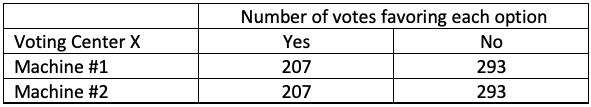
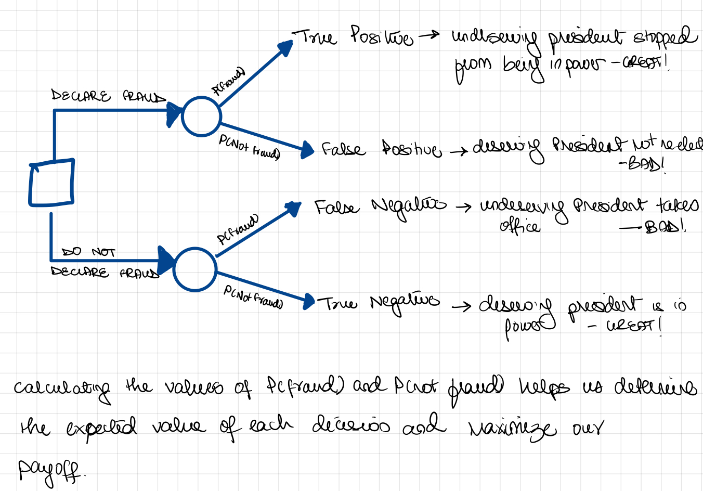
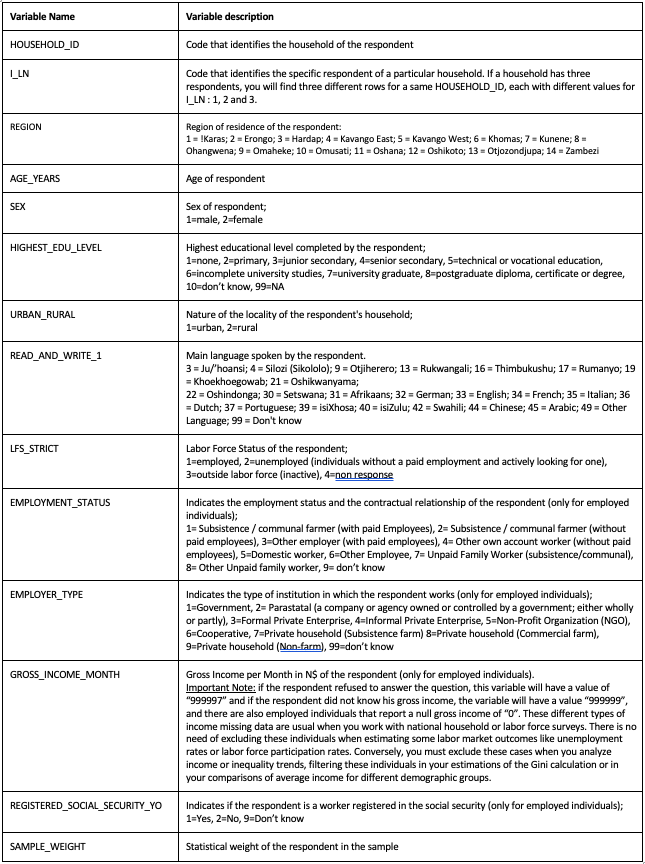

```{css, echo=FALSE}
.answer-box {
  background-color: LemonChiffon;
}
```

```{r setup, include=FALSE}
knitr::opts_chunk$set(echo = TRUE)
knitr::opts_chunk$set(options(width = 60))
knitr::opts_chunk$set(class.output = "bg-warning")

packages <- c('haven','dplyr', 'ggplot2', 'reshape2', 'tidyverse', 'pracma',
              'lubridate', 'scales', 'ggthemes', 'gt', 'dineq', 'gglorenz')  
to_install <- packages[!(packages %in% installed.packages()[,"Package"])]
if(length(to_install)>0) install.packages(to_install)
lapply(packages, require, character.only=TRUE)


```

\definecolor{shadecolor}{RGB}{255, 252, 204}

# INSTRUCTIONS

To successfully complete this problem set, please follow
these steps:

1.  **Download this RMarkdown document file into your
    computer.**

2.  **Insert all your answers into this document.** Guidance
    [**here**](https://www.rstudio.com/blog/exploring-rstudio-visual-markdown-editor/)
    on how to insert objects such as handwritten work or
    screenshot images in your answers.

3.  **SAVE your work frequently**.

4.  To make things easier to visualize in RStudio, you can
    set the view mode as "Visual" instead of as "Source" in
    the top left of your screen (just below the Save
    button).

5.  Once your document is complete, please save it as a PDF
    by clicking the **KNIT** button.

6.  Please submit an electronic copy of the PDF (and any
    separate requested files) to the Canvas course page.

    6.a) If you want to check a PDF version of this problem
    set before starting to work on it, you can always knit
    it. In fact, you can knit the document at any point.

    6.b) If you cannot Knit and it's time to submit the
    problem set, submit the RMarkdown file and make an
    appointment with a member of the teaching team

7.  Remember to consult the R resources from math camp,
    particularly the HKS R cheat sheet (available
    [**here**](bit.ly/HKS-R), which contains many of the
    commands needed to answer the questions in this problem
    set.

# IDENTIFICATION

1.  Your information

```{text}
Last Name:  Chaturvedi                             
First Name: Shreya
```

2.  Group Members (please list below the classmates you
    worked with on this problem set):

```{text}
Group members: Manisha Jha
```

3.  Compliance with Harvard Kennedy School Academic Code: Do
    you certify that my work in this problem set complies
    with the Harvard Kennedy School Academic Code[^1] (mark
    with an X below)?

[^1]: Technically, the seat numbers were changed slightly so
    that we could have seat numbers going consecutively from
    1 to 87 (i.e., without skipping any number).

```{text}
                             [X  ] YES                [   ] NO
```

\newpage

# QUESTION 1 -- ELECTIONS IN VENEZUELA

Venezuelans voted on a referendum to recall President Hugo
Chavez on August 15th, 2004. The official results gave the
victory to Pres. Chavez (59% in favor of keeping him in
office and 41% against). Opposition supporters argued that
there was fraud. This question asks you to put yourself in
the position of an objective statistical analyst trying to
find out whether the opposition claims are supported by the
evidence.

{width="684"}

This problem set question is based on real events, but we
will make a few simplifying assumptions. The voting process
worked for the most part in the following manner: Each voter
was assigned to one of the 8,394 voting centers nationwide.
In each voting center, there were two electoral machines.
Voters had to select "Yes" (the option favoring recalling
the president) or "No" (the option favoring keeping the
president in office).

(a) The pro-opposition governor of a state declared fraud
    shortly after the official results were announced.
    According to these results, two machines in one of the
    centers located in this governor's state reported the
    exact same number of "Yes" votes (207). The table below
    describes the voting results for this center. The
    governor argued that it was extremely unlikely for this
    event to occur and said this was evidence of fraud.
    Calculate the probability that both machines in this
    center reported exactly 207 "Yes" votes. To do this you
    may make the following assumptions:

    1.  Voters were distributed randomly across the two
        machines in each center, so you may assume that
        voting outcomes in both machines are independent.

    2.  For any given person, the probability of voting
        "Yes" is 0.40 and this probability (denoted as p) is
        the same for the two machines in each voting center.

    3.  **Hint:** for this and the following sub-question
        you might find the binomial distribution command in
        R helpful: `dbinom(x = , size = , prob = )`.

------------------------------------------------------------

::: answer-box
**Answer:**

Show your calculations here (type them or paste a legible
picture).

To find the probability of the voters in a particular
machine having 207 Y and 293 N votes can be calculated as
500C207\*(0.4)^207^\*(0.6)^293^ - calculated using the
dbinom function below.

Since voters are distributed independently, the probability
of two machines having the exact same distribution is the
square of this calculated probability from above.

Using the computation from code chunk below, we get the
probabilty of any one machine having this distribution as
2.9%, whereas the probability that two machines had this
exact distribution of votes is 0.08%
:::

```{r}
p1 <- dbinom(x = 207, size = 500, prob = 0.4)
p2 <- dbinom(x = 207, size = 500, prob = 0.4)
pf <- p1*p2
p1
p2
pf
```

------------------------------------------------------------

(b) Calculate the probability that both machines in this
    center reported exactly the same number of "Yes" votes
    (regardless of whether it's 207 or some other number).
    Call this probability q. You may use R or Excel to help
    you in these calculations, but make sure you specify in
    your answer the formula you used to compute the
    probability. You may use the same assumptions as in part
    (a).

------------------------------------------------------------

::: answer-box
**Answer:**

Show your calculations here (type them or paste a legible
picture).

Assuming that both machines have 500 voters, this
calculation is basically:

P(both machines have 0 Yes) + P(both machines have 1 Yes) +
... + P(both machine have 500 Yes)

Where P(both machines have N Yes) = P(Machine 1 has N Yes)
\* P (Machine 2 has N Yes)

and where P(Machine 1 has N Yes) = P(Machine 2 has N Yes) =
500CN\*(0.4)^N^ \*(0.6)^(1-N)^

We can solve this using the R code snippet below and get
this probability as 2.6%
:::

```{r}
sum(dbinom(0:500,500,0.4)^2)

```

------------------------------------------------------------

(c) Other people started noticing that in their voting
    center both machines had the same number of "Yes" votes.
    Calculate how many centers you would predict would have
    the same number of "Yes" votes. You can make the same
    assumptions as in part (a), and assume that the two
    machines in each center received the same total number
    of votes (500 votes per machine) and that voting centers
    are independent.

------------------------------------------------------------

::: answer-box
**Answer:**

Show your calculations here (type them or paste a legible
picture).

We can interpret the answer above as "For every 100
machines, 2.6 machines would have the same breakdown of Yes
and No votes" assuming all voting centers are independent
and get 500 votes each. Therefore, for 8394 voting centers,
we can expect 216.11 machines to have the same number of
votes.
:::

------------------------------------------------------------

(d) The number of voting centers that exhibit the same
    number of "Yes" votes that you calculated in (c) is an
    expected value. But because of random fluctuations, the
    actual number could be higher or lower on any given
    election day. This question asks you to "simulate" 1,000
    times what might have happened on election day (i.e. how
    many voting centers would exhibit the same number of
    "Yes" votes across the two machines if Election Day had
    happened 1,000 times). As this might be the first time
    you will be doing simulations using R, we will provide
    you the code for the simulation and the histogram. This
    is an opportunity to learn more about using R. You will
    learn how to do loops and simulations later in the
    semester.

    Once you have 1,000 estimates for the number of voting
    centers that have the same number of "Yes" votes, report
    the following:

    1.  Average number of voting centers with same number of
        yes votes;

    2.  Draw a histogram with the 1,000 estimates.

------------------------------------------------------------

```{r echo=FALSE, message=FALSE, warning=FALSE}
# Probability of getting the same amount of YES in both machines
exercise_b <- dbinom(0:500,500,0.4)^2
prob_b <- sum(exercise_b)

# Simulation
simulation <- rbinom(1000, 8394, prob_b)
simulation_2 <- simulation/8394

# Average number of voting centers with two machine with the same number of Yes
paste0("The avg. num. of voting centers with two machines with the same number of YES is ",
       round(mean(simulation),2))

round(sd(simulation),2)

# Standard deviation of voting centers with two machine with the same number of Yes
paste0("The standard deviation of voting centers with two machines with the same number of YES is ",
       round(sd(simulation),2))

# Plotting
simulation_table  <- data.frame(simulation,simulation_2)
simulation_table  <- rename(simulation_table, 
       number = simulation, 
       rate = simulation_2) 

ggplot(simulation_table, aes(x = number)) + 
  geom_histogram(aes(y = stat(density*width)),
                     binwidth=1, 
                     color="white") + 
  geom_vline(aes(xintercept = 216), 
             colour="#ef652f",
             linetype = "dashed", 
             size = 0.5) +
  scale_y_continuous(labels = percent) +
  labs(x="Number of voting centers with the same number of YES votes", 
       y = "Relative frequency", 
       title="Venezuela's Election Simulation",
       subtitle="  Distribution of voting centers with the same number of votes for YES in both voting machines.", 
       caption="Results from 1,000 simulations. 
            Hypothesis: 8,394 voting centers, each with two voting machines. Each machine registers only two voting options, YES and NO. The probability of voting YES is 40%.") +
  theme(plot.title=element_text(size=12, hjust=0),
        plot.subtitle=element_text(size=8,hjust=0),
        plot.caption= element_text(size=7), 
        axis.title.x=element_text(size=12,hjust=0.5),
        axis.title.y=element_text(size=12,hjust=0.5)) +
  annotate("text", x=216, y=0.05, label="Expected value = 216")
```

3.  Is this average similar to the number you calculated in
    (c)? Why or why not?

::: answer-box
**Answer:**

Yes, the computed average (216.54) is very similar to the
average I computed (216.11). This is because once we start
running a simulation for a large enough N, the calculated
mean gets very close to the expected value we get from the
probability calculation.
:::

------------------------------------------------------------

e.  As indicated above, the opposition governor argued that
    it was extremely unlikely to observe two machines in a
    voting center report the exact number of "Yes" votes.
    When other voting centers reported the same, some
    opposition leaders started counting such centers.
    Suppose they counted 225 centers that exhibited the same
    number of "yes" votes in their two machines. Would you
    conclude that this is likely the results of random
    fluctuations (i.e., due to chance) or such an unlikely
    event that you think something suspicious might be going
    on? Explain.

------------------------------------------------------------

::: answer-box
**Answer:**

Please enter your answers here.

The standard deviation for this distribution is 14.2. If we
approximate this distribution to be normal, values that are
one SD more and less than the mean would occur about 68% of
the times.

This means that for values that are +/1 one SD from the mean
(that is 216-14 to 216+14 or 202 to 230) are likely to occur
without tampering and due to random chance.

Of course, we are making two judgement calls here - one
being regarding the distributions normality, and the second
regarding the threshold of 1 SD (as opposed to 2 or 3). But
even then, I am inclined to conclude that this event is not
an indicator of malpractice.
:::

------------------------------------------------------------

f.  The opposition want you to tell them how large does the
    number of voting centers that report the same number of
    "Yes" votes has to be for you to conclude that something
    suspicious might be going on (i.e., that the deviations
    from what you would expect are unlikely to be explained
    by chance). How would you respond?

------------------------------------------------------------

::: answer-box
**Answer:**

Please enter your answers here.

Building on the explanation in part (e), if more than 230
voting centers have the same number of votes, I would be
inclined to conclude that there might be some kind of foul
play at hand.
:::

------------------------------------------------------------

g.  Suppose that you are a conscientious member of the
    national electoral commission trying to decide whether
    to declare that there was fraud in the election. Draw a
    decision tree to help structure the decision. For the
    probabilities, explain how the analysis above could help
    you. For the payoffs, write a few words (in the branches
    of the trees) that describe how good or bad this outcome
    is for the country.

------------------------------------------------------------

::: answer-box
**Answer:**

Please insert your decision tree here and explain the
outcomes.
:::



------------------------------------------------------------

h.  The decision tree will hopefully illustrate for you the
    tradeoff between two types of errors you could make in
    your decision. Briefly describe these errors, the nature
    of the trade off, and how these errors relate to ideas
    we have studied in this course or that you have studied
    before.

------------------------------------------------------------

::: answer-box
**Answer:**

Please enter your answers here.

The two types of errors are false negatives and false
positives. The first is when we do not declare a fraud when
there had been one, and the second is when we declare a
fraud when there had not been one.

These errors are quite similar to the ones we did in our
mammography case, where the cost of a false positive (a
deserving President is not allowed to take power due to
false allegations) and of a false negative (a undeserving
President takes office) are quite high.
:::

------------------------------------------------------------

# QUESTION 2 - LEARNING ABOUT LABOR MARKET OUTCOMES AND INEQUALITY IN NAMIBIA[^2]

[^2]: I am very grateful to Luca Sartorio (MPA-ID 2022) for
    his excellent work to help design and write this
    question.

The goal of this problem set question is to help you
continue developing your R skills to shed light on labor
market outcomes and income inequality in Namibia, a country
with about 2.5 million people located in Southern Africa. To
produce your statistical analyses, you will be using the
Namibia Labor Force Survey 2018, a household survey that
covers all 14 administrative regions of the country.
Household surveys are widely used in many countries to gain
an understanding on a host of issues relevant to many areas
including education, health, employment, poverty and many
others. Hence, while this question involves using a
particular survey to analyze labor market outcomes in a
particular country, the skills you develop are likely to
generalize to many other areas you might be interested in.

Some notes about the data and the exercise:

-   **Data sets**: You will be using the file
    "lfs_cleaned.dta" which contains only respondents aged
    15 to 65. You will use the file "lfs_original.dta" only
    for question (5).

-   **Weights**: To make the sample representative of the
    whole country, you will need to use sampling weights to
    account for the fact that some groups are
    under/over-represented in the data set. Many R commands
    allow for the use of weights. But different commands
    have different syntax for incorporating weights.

-   **Missing Values**: In household surveys (and in several
    other datasets), missing values may be directly reported
    as "`NA`" or may be indirectly identified as missing.
    For example, the variable EMPLOYER_TYPE has both `NAs`
    and the value "99" which identifies individuals that
    answered that they do not know the nature of their
    employers. In this problem set, you will need to exclude
    both types of missing values in the relevant variables.

-   **There are some hints at the end of this exercise to
    help you with the questions below.** My advice is that
    you refer to these hints only after having tried to
    figure out how to do it by yourself; this will better
    allow you to develop your R skills.

The key variables in the Labor Force Survey (LFS) that you
will use from this data set are the following:



Please answer the following questions:

1.  We will first characterize basic labor market
    statistics. Calculate the following statistics:

    1.  **Labor force participation rate (LFPR):** The LFPR
        is a measure that identifies the share of
        working-age individuals employed or actively seeking
        employment (a group that is usually referred as
        "labor force" or "active population") over the
        number of individuals in the working-age-population.
        The LFPR can be estimated as the sum of individuals
        in the labor force divided by the total
        working-age-population and we will define the
        "working age population" as the sum of individuals
        aged 15 to 65[^3]. Calculate LFPR, being sure to
        appropriately sum the sample weights rather than
        summing just over the number of rows in your data
        set meeting some employment criteria (see footnote).
        You can calculate total working age population by
        excluding those with a response of '4' in the
        LFS-STRICT variable.

    ```{r echo=FALSE, message=FALSE, warning=FALSE}
    # Insert only code here.
    library(haven)
    lfs_cleaned <- read_dta("lfs_cleaned.dta")
    #1+2/1+2+3
    totalworkingage = sum(lfs_cleaned[which(lfs_cleaned$LFS_STRICT!=4),"SAMPLE_WEIGHT"])
    laborforceindividuals = sum(lfs_cleaned[which(lfs_cleaned$LFS_STRICT < 3),"SAMPLE_WEIGHT"])

    lfpr = laborforceindividuals/totalworkingage
    lfpr


    ```

    2.  **Unemployment rate:** The unemployment rate
        represents the number of unemployed people as a
        percentage of the labor force (or "active
        population"). Unemployed individuals are defined as
        those of working age who are available to work and
        looking for a job but are not employed. Unemployed
        individuals have a response of '2' for the
        LFS-STRICT variable.

    ```{r echo=FALSE, message=FALSE, warning=FALSE}
    # Insert only code here.
    #2/1+2
    unemployed = sum(lfs_cleaned[which(lfs_cleaned$LFS_STRICT==2),"SAMPLE_WEIGHT"])
    unemploymentrate = unemployed/laborforceindividuals
    unemploymentrate
    ```

    3.  **The share of "non-employed" individuals of the
        working-age population:** this metric quantifies the
        number of "non-employed" individuals (which may or
        not be looking for a job) as a percentage of the
        working-age-population. Non-employed individuals
        have a response of either '2' or '3' for the
        LFS-STRICT variable.

    ```{r echo=FALSE, message=FALSE, warning=FALSE}
    # Insert only code here.
    #2+3/1+2+3
    nonemployed = sum(lfs_cleaned[which(lfs_cleaned$LFS_STRICT==2|lfs_cleaned$LFS_STRICT==3),"SAMPLE_WEIGHT"])
    nonemployedrate = nonemployed/totalworkingage
    nonemployedrate
    ```

    4.  What is the **analytical value** added of the answer
        to question (2) over the answer to question (3)? Why
        is it useful to estimate both measures?

[^3]: There are different types of sampling weights. In this
    survey, the weights are such that if an observation has
    a weight of 50, it means that this observation
    represents 50 individuals from the population of
    Namibia. So if you want to calculate the number of
    unemployed individuals, you need to sum up all the
    weights of the unemployed individuals in the data set.

------------------------------------------------------------

::: answer-box
**Answer:**

Enter your answer here.

(2) Implies that 1 in 5 of the active labor force is
    currently unemployed and looking for a job.

(3) Implies that nearly 1 in 2 people is employed while the
    other 1 may or may not be looking for a job.

It is useful to estimate both measures as either of them
individually do not tell us much about the breakdown of the
labor market into employed, seeking employment, and not
seeking employment groups.
:::

------------------------------------------------------------

2.  The Gini index is probably the most frequently used
    measure of inequality, and is a number that goes from 0
    to 1, where a value of 0 represents a theoretical
    situation of "perfect equality" (everybody has the same
    income) and a value of 1 represents a situation of
    "perfect inequality" (when one person gets the entire
    income of a city, province or nation, world)[^4].

    1.  Estimating a Gini index requires income data of the
        individuals (and their corresponding statistical
        weights). Read the documentation for the command
        '`gini.wtd`' contained in the package '`dineq`' and
        then calculate the Gini coefficient for income in
        Namibia. Report this number. Based on this Gini
        coefficient, is Namibia a very unequal country?
        Explain.

    ```{r echo=FALSE, message=FALSE, warning=FALSE}
    # Insert only code here.
    library(dineq)
    library(ineq)
    lfs_cleaned$GROSS_INCOME_MONTH <- ifelse(lfs_cleaned$GROSS_INCOME_MONTH %in% c(999999,999997),NA,lfs_cleaned$GROSS_INCOME_MONTH)
    lfs_cleaned$GROSS_INCOME_MONTH <- ifelse(lfs_cleaned$GROSS_INCOME_MONTH == 0 & lfs_cleaned$LFS_STRICT == 1,NA,lfs_cleaned$GROSS_INCOME_MONTH)
             
    gini_wtd <- gini.wtd(x=lfs_cleaned$GROSS_INCOME_MONTH, weights = lfs_cleaned$SAMPLE_WEIGHT)
    gini_wtd
    ```

    ::: answer-box
    **Answer:**

    Please enter your explanations here

    Based on this answer, Nambia is a highly unequal country
    as the Gini coefficient is closer to 1.
    :::

    2.  Now report the Gini coefficient without using
        weights. Is the answer similar to the one you
        calculated just above? Explain.

    ```{r echo=FALSE, message=FALSE, warning=FALSE}
    # Insert only code here.
    gini_uwtd <- gini.wtd(x=lfs_cleaned$GROSS_INCOME_MONTH)
    gini_uwtd
    ```

    ::: answer-box
    **Answer:**

    Please enter your explanations here

    The unweighted Gini coeffecient is quite close but
    slightly higher than the weighted value (0.64 vs 0.65).
    This could imply that the subgroup underrepresented in
    our sample have an income higher/lower than the average,
    causing the inequality to rise slightly when the weights
    are incorporated.
    :::

    3.  [**Optional**: Display a Lorenz curve for Namibia.]

    ```{r echo=FALSE, message=FALSE, warning=FALSE}
    # Insert only code here.
    Lc(lfs_cleaned$GROSS_INCOME_MONTH, plot = TRUE)
    ```

3.  The Gini you calculated above gives you a sense of
    overall inequality in the country. Given the history of
    the country, one important measure looks at inequality
    across different ethnic groups.

    1.  Calculate average income for Africans, Afrikaans and
        Europeans. What do you notice? Notice that the LFS
        does not have a variable that directly identifies
        the ethnic group of the individual. Use the main
        language of the individual as a proxy to overcome
        this limitation, using the following categorization
        of languages:

        1.  African Languages: Ju/'hoansi, Silozi
            (Sikololo), Otjiherero, Rukwangali, Thimbukushu,
            Rumanyo, Khoekhoegowab, Oshikwanyama,
            Oshindonga, Setswana, isiXhosa, isiZulu, Swahili
        2.  Afrikaans Languages: Afrikaans
        3.  European Languages: German, English, French,
            Dutch, Portuguese, Italian

[^4]: The Gini index measures the distance of the Lorenz
    curve (that represents the income distribution in a
    particular country) with a theoretical situation of
    perfect equality. You can find a detailed explanation of
    what a Lorenz curve is and how the Gini index is
    estimated in the following link:
    <https://towardsdatascience.com/clearly-explained-gini-coefficient-and-lorenz-curve-fe6f5dcdc07>

Please consider all the other values as `NA` values that
must be excluded in this section.

```{r echo=FALSE, message=FALSE, warning=FALSE}
# Insert only code here.
lfs_cleaned <- lfs_cleaned %>%
  mutate(ethnicity = case_when(READ_AND_WRITE_1 %in% c(3,4,9,13,16,17,19,21,22,30,39,40,42) ~ "1"
                   ,READ_AND_WRITE_1 %in% c(31) ~ "2"
                   ,READ_AND_WRITE_1 %in% c(32,33,34,35,36,37) ~ "3"
                   ,TRUE ~ "NA"
                   ))

lfs_cleaned %>%
  group_by(ethnicity) %>%
  summarise(income = sum(GROSS_INCOME_MONTH*SAMPLE_WEIGHT/sum(SAMPLE_WEIGHT),na.rm = TRUE))
```

::: answer-box
**Answer:**

Enter your explanation here.

The average incomes for Africans is significantly lower than
that of Afrikaans and Europeans.
:::

2.  Now calculate the Gini coefficient within each ethnic
    group. Considering your response in (3.1) and your
    estimation of the overall Gini Index in (3), how do you
    interpret this information?

```{r echo=FALSE, message=FALSE, warning=FALSE}
# Insert only code here.

subset1 <- lfs_cleaned %>%
  filter(ethnicity == "1")
gini_wtd_1 <- gini.wtd(x=subset1$GROSS_INCOME_MONTH, weights = subset1$SAMPLE_WEIGHT)

subset2 <- lfs_cleaned %>%
  filter(ethnicity == "2")
gini_wtd_2 <- gini.wtd(x=subset2$GROSS_INCOME_MONTH, weights = subset2$SAMPLE_WEIGHT)

subset3 <- lfs_cleaned %>%
  filter(ethnicity == "3")
gini_wtd_3 <- gini.wtd(x=subset3$GROSS_INCOME_MONTH, weights = subset3$SAMPLE_WEIGHT)

gini_wtd_1
gini_wtd_2
gini_wtd_3
```

::: answer-box
**Answer:**

Enter your explanation here.

There seems to be a high degree of inequality between groups
(Africans vs Afrikaans and Europeans) as indicated from the
mean values, but also a lot of inequality within each group
as computed from the group-wise weighted Gini coefficients.
:::

3.  [**OPTIONAL:** To be able to more formally understand
    how much of the observed inequality in Namibia is driven
    by differences in labor market outcomes among the
    different ethnic groups, you can decompose the overall
    gini measure into separate sources: Within-inequality,
    which measures inequality within each ethnic group and
    between-inequality, which measures inequality between
    the different ethnic groups. The '`dineq`' package
    contains another function '`gini_decomp`' which
    allocates the gini calculation to within and between
    group measures. Use the command `gini_decomp` to
    calculate the population-weighted between and within
    group gini coefficients. Also report the overlap term.]

```{r echo=FALSE, message=FALSE, warning=FALSE}
# Insert only code here.

```

------------------------------------------------------------

::: answer-box
**Answer:**

Enter your answer here.
:::

------------------------------------------------------------

4.  The dataset we gave you at the beginning
    ("lfs_cleaned.dta") is not the one you would download
    from the Namibia Statistics Agency or the International
    Labour Organization (ILO). We had to do things to the
    data set for it to be ready for analysis. This process
    is typically referred to as data cleaning (or data
    wrangling, if you prefer a fancier name). It is not a
    glamorous process, but it is essential to analyzing
    data. In this question, we will guide you through
    [some]{.underline} of the key steps employed, so you can
    get a flavor of what is involved and develop some
    appreciation for what is required. For this question,
    you will use the "lfs_original.dta" dataset that
    corresponds to the file that you can actually download
    from the Namibia Statistics Agency. With this dataset,
    you will conduct a very simple and limited data cleaning
    exercise to create a new cleaned dataset that is similar
    to the one that you used during this problem set (the
    "lfs_cleaned.dta" file). For that purpose, please:

    1.  Create a new reduced dataset that only contains the
        variables described in the initial table.

    2.  Transform the REGION variable into a factor variable
        that identifies each region by its actual name (such
        as "Ohangwena" or "Erongo") instead of by numbers
        (such as "8" or "2").

    3.  Eliminate all the observations that are directly
        identified as `NAs` in the variable LFS_STRICT
        (Note: in this case, do not eliminate the
        observations with value "4", only the observations
        that are explicitly identified as `NAs`).

    4.  Drop all the individuals that are not part of the
        working age (aged 15 to 64) population.

```{r echo=FALSE, message=FALSE, warning=FALSE}
# Insert only code here.
library(haven)
lfs_original <- read_dta("lfs_original.dta")

lfs_original <- lfs_original %>%
  select(HOUSEHOLD_ID, I_LN, REGION, AGE_YEARS, SEX, HIGHEST_EDU_LEVEL, URBAN_RURAL, READ_AND_WRITE_1, LFS_STRICT, EMPLOYMENT_STATUS, EMPLOYER_TYPE, GROSS_INCOME_MONTH, REGISTERED_SOCIAL_SECURITY_YO,SAMPLE_WEIGHT) %>%
  mutate(REGION_2 = case_when(REGION == 14 ~ "Zambezi",
                              REGION == 13 ~ "Otjozondjupa",
                              REGION == 12 ~ "Oshikoto",
                              REGION == 11 ~ "Oshana",
                              REGION == 10 ~ "Omusati",
                              REGION == 9 ~ "Omaheke",
                              REGION == 8 ~ "Ohangwena",
                              REGION == 7 ~ "Kunene",
                              REGION == 6 ~ "Khomas",
                              REGION == 5 ~ "Kavango West",
                              REGION == 4 ~ "Kavango East",
                              REGION == 3 ~ "Hardap",
                              REGION == 2 ~ "Erongo",
                              REGION == 1 ~ "!Karas"))%>%
 filter(AGE_YEARS > 14 & AGE_YEARS < 65 & LFS_STRICT %in% c(1,2,3,4))

  
  

```

5.  What did you learn from doing this exercise about
    Namibia, labor markets, and/or doing statistical
    analysis?

------------------------------------------------------------

::: answer-box
**Answer:**

Enter your answer here.

Learnings:\
1. Importance of data cleaning as per the intended purposes
and how to incorporate sample weights in analysis

2.  How to measure inequality across and within different
    groups at a national level
3.  Different measures of employment used in labor market
    students
4.  Major ethnic groups and their socio-economic standing at
    a national level in Namibia
:::

------------------------------------------------------------

# HINTS for R

1: Commands used: `filter` and `summarize`

2: Commands used: `summarize` and `gini.wtd`

3.1: `case_when`, `mutate`, `group_by`, `summarize`, and
`weighted.mean`

3.2: `summarize`, `group_by` and `gini.wtd`

3.3: `summarize`, `group_by`, `weighted.mean` and
`gini_decomp`.

4.1: `select`

4.2: `mutate` and `recode` or `ifelse`

4.3: `filter`, `is.na`

4.4: `filter`

# QUESTION 3a -- ONLINE MODULE ON ESTIMATORS

The goal of this problem set question is to help you prepare
you for the class on **Estimators** that will be held in an
upcoming class. The idea is to get everyone familiar with
the basics of estimators and their key properties so that we
can delve deeper in class on this topic than we would be
able to do if we had to go through the basics in class.

You will be asked to watch a short module and answer some
questions in a quiz. The quiz results will give me
information about overall performance of the class that I
will use to prepare for class; your individual performance
in the quiz will be registered in the system but will not
count towards your grade in any way.

To get full credit for this question, you need to watch the
module and complete the quiz.

The module is available
[here](https://canvas.harvard.edu/courses/109224/pages/1-introduction?module_item_id=1176548).

------------------------------------------------------------

::: answer-box
**Answer:**

*Please enter "Done" in this field once you have completed
the quiz.*

Done
:::

------------------------------------------------------------

# QUESTION 3b -- ONLINE MODULE ON SAMPLING DISTRIBUTIONS

The goal of this problem set question is to help you prepare
you for the class on **Sampling Distributions** that will be
held in an upcoming class. Rationale and instructions are
the same as for part 3A above. The module is available
[here](https://canvas.harvard.edu/courses/109224/pages/sampling-distributions?module_item_id=1176551).

------------------------------------------------------------

::: answer-box
**Answer:**

*Please enter "Done" in this field once you have completed
the quiz.*

Done
:::

------------------------------------------------------------

# QUESTION 4 - LEARNING ABOUT SAMPLING THROUGH SEATING ASSIGNMENTS

In this problem set question, you will learn some important
statistical concepts related to statistical inference. The
file "API-209 seating assignments 2022" contains the seating
number assignment for each student in our class[^5].
Throughout this exercise, assume that the students in
API-209 is our population of interest. Denote Y as a
variable representing the seat number.

[^5]: Technically, the seat numbers were changed slightly so
    that we could have seat numbers going consecutively from
    1 to 87 (i.e., without skipping any number).

1.  **Distribution of Y in the population:** Construct a
    relative frequency histogram of the data (i.e. show
    proportions on the y-axis, instead of counts -- see R
    cheat sheet for recommended method). Describe the
    distribution seat numbers in the population. Indicate
    the number of observations that were used to draw this
    histogram. Calculate the following basic summary
    statistics for the population:

    a.  Mean ($\mu$)
    b.  Standard Deviation ($\sigma$)

```{r echo=FALSE, message=FALSE, warning=FALSE}
# Insert only code here for the histogram and the summary statistics.

library("readxl")

seating_assignments <- read_excel("API-209 seating assignments 2022.xlsx")

seating_assignments %>%
  ggplot(aes(x = seat_number)) +
  geom_histogram(aes(y = stat(count/sum(count))), binwidth = 1) +
  ylab("Relative Frequency/Proportion") +
  xlab("Count = 89")

mean_89 = mean(seating_assignments$seat_number)
sd_89 = sd(seating_assignments$seat_number)

mean_89
sd_89

```

------------------------------------------------------------

::: answer-box
**Answer:**

Please enter your answers describing the histogram here

The histogram is a straight line since each seat number is
only assigned once or 0.011 of the times.
:::

------------------------------------------------------------

2.  **Distribution of Y in the sample:** Draw a random
    sample of 30 students from this population. To do this
    in R, use the command `sample_n`, e.g. type
    `samp_seat <- sample_n(seat, 30)`. Construct a relative
    frequency histogram of these data. Describe the
    distribution of seat numbers in this sample. Is this
    distribution what you would expect? Is it similar to the
    distribution of Y in the population? Indicate the number
    of observations that were used to draw this histogram.

***Notes:***

-   Your histogram will look a bit different than those of
    different members of your study group. That's OK. Think
    about why.
-   We recommend using 1 as your bin size.
-   Use `xlim` to make x axis start at 0.

Calculate the following basic summary statistics for the
sample:

a.  Mean ($\overline{Y}$)
b.  Standard Deviation ($s$)

```{r echo=FALSE, message=FALSE, warning=FALSE}
# Insert only code here.

set.seed(82402)
samp_seat <- sample_n(seating_assignments, 30)
samp_seat %>%
  ggplot(aes(x = seat_number)) +
  geom_histogram(aes(y = stat(count/sum(count))), binwidth = 1) +
  ylab("Relative Frequency/Proportion") +
  xlab("Count = 30")

mean_30 = mean(samp_seat$seat_number)
sd_30 = sd(samp_seat$seat_number)

mean_30
sd_30
```

------------------------------------------------------------

::: answer-box
**Answer:**

Please enter your answers describing the histogram here

Looks like a barcode!\
This histogram is similar to the one above, but with one key
difference: Instead of all 89 observations showing up 1.1%
of the times, only a subset of 30 observations show up (now
3.3% of the times) and the remaining 59 show up 0 times
(hence the blanks).
:::

------------------------------------------------------------

3.  **Population vs. Sample:** Is the mean total cases in
    the above sample (i.e., 2.a) the same as the mean total
    cases in the population (i.e., 1.a)? Is this what you
    expected? Why or why not? (2-3 sentences)

------------------------------------------------------------

::: answer-box
**Answer:**

Please enter your answers here.

The mean for the whole population (45) is not the same as
the mean for the sample (52.16). This is expected since when
we draw a sample from the population (ie take only a subset
from the whole population), the mean is not always the same.
If we draw samples repeatedly, this mean will start
resembling a normal distribution.
:::

------------------------------------------------------------

4.  *Small samples:* Now let's think about random samples of
    2 students from the population, and answer the following
    questions:

    1.  How many possible distinct samples of size 2 could
        we draw from this population?

------------------------------------------------------------

::: answer-box
**Answer:**

Please enter your calculations here

We can draw 89C2 samples - that is 89\*88/2 = 3916 samples.
:::

------------------------------------------------------------

2.  How many of these samples of size 2 will have an
    **average** seat number greater than 88?

------------------------------------------------------------

::: answer-box
**Answer:**

Please enter your calculations here

The average seat number will be greater than 88 only when we
select 88 and 89, that is, in only one sample.
:::

------------------------------------------------------------

3.  How likely is it to draw a sample of size 2 whose
    **average** seat number is greater that 88?

------------------------------------------------------------

::: answer-box
**Answer:**

Please enter your calculations here

The probability of drawing a sample with average seat number
greater than 88 is

number of favorable events/total possible events = 1/3916

=0.025%
:::

------------------------------------------------------------

4.  Please answer this brief
    [**survey**](https://docs.google.com/forms/d/e/1FAIpQLSf8voRsO97_GnxBTKgtgMHY1Y-XBui89F0kx8TD4HKx3FN_AA/viewform)

------------------------------------------------------------

::: answer-box
**Answer:**

*Please enter "Done" in this field once you have completed
the survey*
:::

------------------------------------------------------------

# TIME USE

Please enter in
[**this**](https://forms.gle/3PKv9zuE9q9NWmrA8) form the
time you spent on each question. This information will only
be used for teaching improvements; **please be candid** and
report the time (in **MINUTES**) spent in each question.

------------------------------------------------------------

::: answer-box
*Please enter "Done" in this field once you have completed
the quiz.*

Done
:::

------------------------------------------------------------

\newpage

**This is a copy of your code.**

```{r ref.label=knitr::all_labels(), echo=TRUE, eval=FALSE}
```
