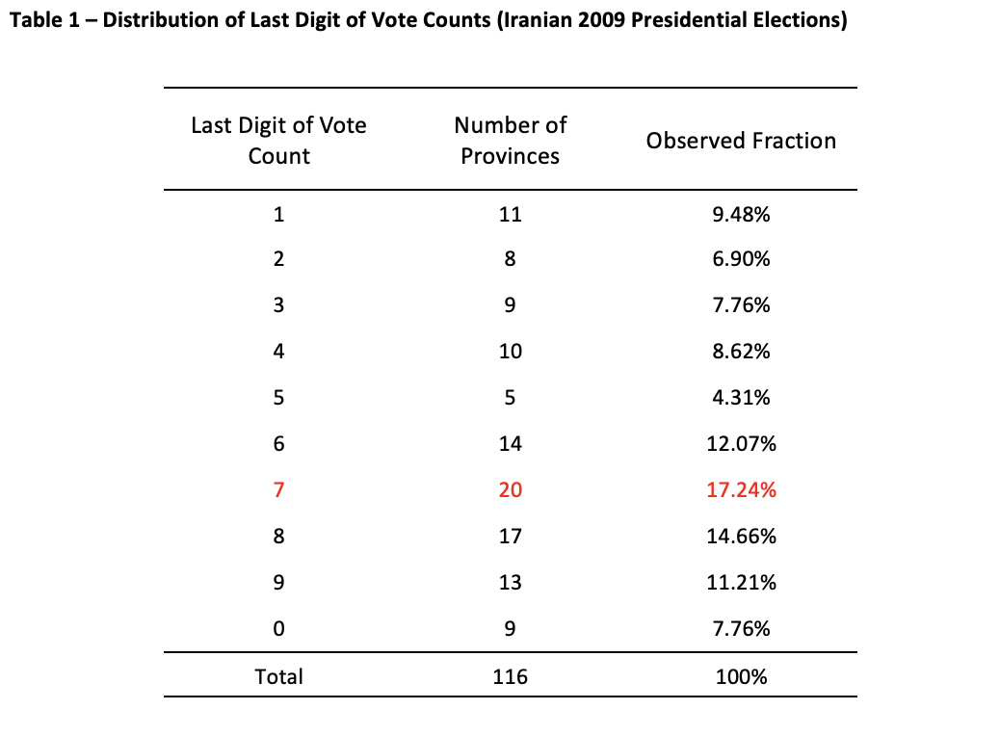
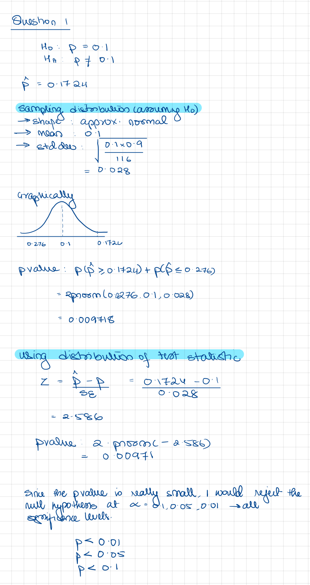
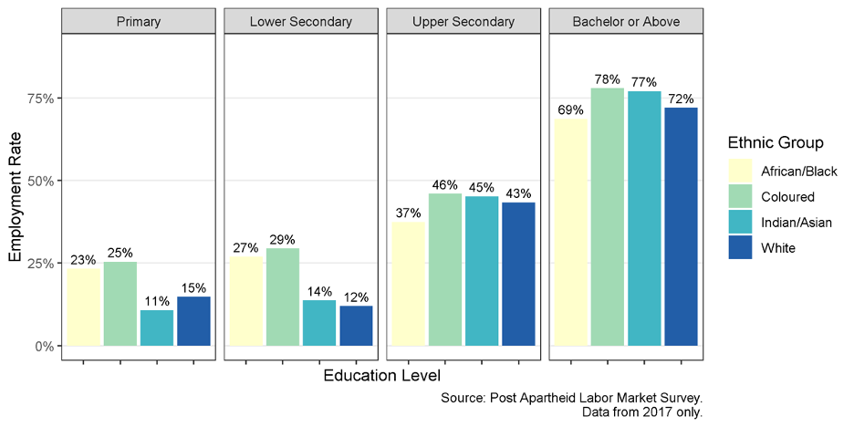
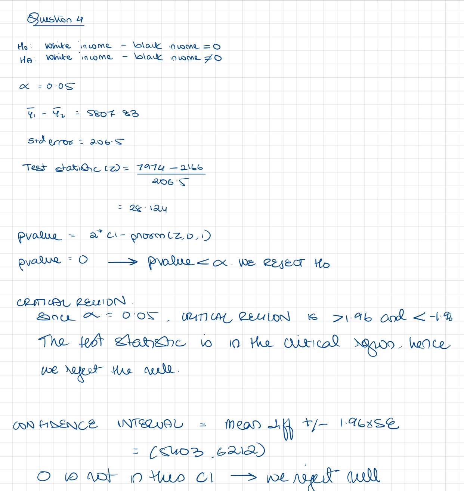

```{css, echo=FALSE}
.answer-box {
  background-color: LemonChiffon;
}
```

```{r setup, include=FALSE}
knitr::opts_chunk$set(echo = TRUE)
knitr::opts_chunk$set(options(width = 60))
knitr::opts_chunk$set(class.output = "bg-warning")

packages <- c('haven','dplyr', 'ggplot2', 'reshape2', 'tidyverse', 'pracma',
              'lubridate', 'scales', 'ggthemes', 'gt', 'dineq', 'gglorenz')  
to_install <- packages[!(packages %in% installed.packages()[,"Package"])]
if(length(to_install)>0) install.packages(to_install, 
                                          repos='http://cran.us.r-project.org')
lapply(packages, require, character.only=TRUE)


```

\definecolor{shadecolor}{RGB}{255, 252, 204}

# INSTRUCTIONS

To successfully complete this problem set, please follow
these steps:

1.  **Download this RMarkdown document file into your
    computer.**

2.  **Insert all your answers into this document.** Guidance
    [**here**](https://www.rstudio.com/blog/exploring-rstudio-visual-markdown-editor/)
    on how to insert objects such as handwritten work or
    screenshot images in your answers.

3.  **SAVE your work frequently**.

4.  To make things easier to visualize in RStudio, you can
    set the view mode as "Visual" instead of as "Source" in
    the top left of your screen (just below the Save
    button).

5.  Once your document is complete, please save it as a PDF
    by clicking the **KNIT** button.

6.  Please submit an electronic copy of the PDF (and any
    separate requested files) to the Canvas course page.

    6.a) If you want to check a PDF version of this problem
    set before starting to work on it, you can always knit
    it. In fact, you can knit the document at any point.

    6.b) If you cannot Knit and it's time to submit the
    problem set, submit the RMarkdown file and make an
    appointment with a member of the teaching team

7.  Remember to consult the R resources from math camp,
    particularly the HKS R cheat sheet (available
    [**here**](bit.ly/HKS-R), which contains many of the
    commands needed to answer the questions in this problem
    set.

# IDENTIFICATION

1.  Your information

```{text}
Last Name:  Chaturvedi                           
First Name: Shreya
```

2.  Group Members (please list below the classmates you
    worked with on this problem set):

```{text}
Group members: Bharath Ram, Manisha Jha
```

3.  Compliance with Harvard Kennedy School Academic Code: Do
    you certify that my work in this problem set complies
    with the Harvard Kennedy School Academic Code[^1] (mark
    with an X below)?

[^1]: We abide by the Harvard Kennedy School Academic code
    (available here) for all aspects of the course. In terms
    of problem sets, unless explicitly written otherwise,
    the norms are the following: You are free (and
    encouraged) to discuss problem sets with your
    classmates. However, you must hand in your own unique
    written work and code in all cases. Any copy/paste of
    another's work is plagiarism. In other words, you can
    work with your classmate(s), sitting side-by-side and
    going through the problem set question-by-question, but
    you must each type your own answers and your own code.
    For more details, please see syllabus.

```{text}
                             [ X ] YES                [   ] NO
```

\newpage

# QUESTION 0 - RECORDING TIME

In an effort to understand better and more accurately the
length of time that it takes you to complete problem sets, I
would like to ask you to please fill in the form linked at
the end of this problem set as accurately as possible. **As
you go through this problem set, please keep track of the
time you spend on each question and then record your time
(in minutes).**

# QUESTION 1 -- ELECTIONS IN IRAN

On June 12, 2009, Iran held presidential elections between
the incumbent Mahmoud Ahmadinejad and challenger
Mir-Houssein Mousavi. The official results indicated that
Ahmadinejad won with 62% of the vote. There were several
allegations of fraud. One of the key arguments behind one of
the allegations was that the government had made up vote
counts and that this could be detected statistically. The
underlying notion is that when people make up numbers they
have systematic biases and that the resulting numbers
exhibit a pattern. In the case of the Iranian elections,
analysts looked at the patterns in the last digit of the
official vote counts for Ahmadinejad (i.e., if the vote
count for a province was 5,678, the last digit was 8). They
looked at the vote counts for all 116 provinces in Iran and
tabulated a frequency distribution of the last digit. The
results are below. If no fraud had occurred, one would
expect to see no systematic pattern in the distribution of
the last digit. In other words, one would expect the
distribution of last digit to be discrete uniform (i.e., 10%
frequency for each of the digits). Yet the actual results
seem to be different from this. While this difference could
potentially be due to sampling fluctuations, the analysts
tried to assess statistically whether the deviations were
large enough to warrant suspicion of fraud. In this problem
set question, we will focus on the last digit 7.



1.  Test the hypothesis that the proportion of vote counts
    that end in 7 is equal to 10%. Conduct the test in two
    ways:

    1.  Using the sampling distribution of your estimator,
        and

    2.  Using the distribution of your test statistic.

    In both cases report the **p-value**. Please follow the
    5 steps to conduct hypothesis tests described in handout
    #7. Please indicate at the end whether you would reject
    the null hypothesis.

------------------------------------------------------------

```{r echo=T, message=FALSE, warning=FALSE}
# Feel free to calculate by R or hand

```

::: answer-box
**Answer:**

*Enter your calculations here if done by hand.*
:::



------------------------------------------------------------

2.  Would you conclude there was fraud in the Iranian 2009
    Elections? Explain briefly (one short paragraph) in this
    form:

<https://forms.gle/fCWECB43rP2R5JA48>

NOTE: Please remember to **record the time** it took you to
complete this question.

\newpage

# QUESTION 2 - NERDY FRIEND

**Suppose** a friend from college calls you and asks you how
this course is going. This friend has [not]{.underline}
taken a statistics course before. After giving her your
personal opinion on the instructor, his teaching techniques,
and how lengthy his problem sets are (yes; I know what you
are thinking right now), your friend asks you to summarize
the key concepts you have studied so far in this course.
(OK; maybe by now she is not your friend anymore, or maybe
you argue that you don't have such nerdy friends). You
decide to write her an e-mail (about 2-4 paragraphs long)
explaining the key concepts we have studied so far in this
course [and how they relate to each other]{.underline}. What
would you write to your friend? Make sure you include in
your letter the concepts of probability, estimator,
estimates, sampling distribution, confidence intervals, and
hypothesis testing. Feel free to use diagrams if you think
better visually.

Please write your letter in the following link:

<https://forms.gle/qCJYXAGHk35FpUkHA>

------------------------------------------------------------

::: answer-box
*Please enter "Done" in this field once you have completed
the form.*

Done
:::

------------------------------------------------------------

NOTE: Please remember to **record the time** it took you to
complete this question.

\newpage

# QUESTION 3 -- ONLINE MODULE ON HYPOTHESIS TESTING

**Background:** The goal of this problem set question is to
help you deepen your understanding of the 3 methods of
**hypothesis testing** by illustrating how they link to each
other. You will be asked to watch a short module and answer
some questions in a quiz. The quiz results will give me
information about overall performance of the class that I
will use to prepare for class; your individual performance
in the quiz will be registered in the system but will not
count towards your grade in any way.

**Instructions:**

To get full credit for this question, you need to engage
with the module and complete the quiz. Please make sure you
[**submit**]{.underline} your answers at the end of the
quiz/survey so that they are registered.

Note: This module will likely help you understand the next
question better.

The module is available here:

<https://canvas.harvard.edu/courses/109224/pages/hypothesis-tests-introduction-to-this-module?module_item_id=1176559>

Please watch [**all**]{.underline} of the sub-sections of
the module, and then take the quiz.

------------------------------------------------------------

::: answer-box
*Please enter "Done" in this field once you have completed
the form.*

Done
:::

------------------------------------------------------------

NOTE: Please remember to **record the time** it took you to
complete this question.

\newpage

# QUESTION 4 -- LABOR MARKET OUTCOMES IN SOUTH AFRICA

The question asks you to explore the issue of ethnic
differences in labor market outcomes in post-apartheid South
Africa. In your DEV-101 and DEV-401 courses, you have
examined (or will examine) various possible reasons why the
labor market outcomes between different ethnic groups might
differ. In this problem set question, you will empirically
estimate these differences. In particular, you will examine
how employment levels and earnings vary by ethnic group,
education and gender.

This problem set question will allow you to continue to
develop your R skills by conducting statistical analyses on
a data set derived from the South Africa's Post Apartheid
Labour Market Series (PALMS). For this analysis, we will
focus on sample data collected in 2017. Note that the
observations in the data represent a [**random
sample**]{.underline}, not the population.

The data set provided contains the following variables:

-   [Year]{.underline} -- survey year (restricted to 2017
    for this problem set)

-   [Popgroup]{.underline} -- respondent population group.
    This is a numeric variable corresponding to the
    following categories:

    -   1 = African/Black
    -   2 = Coloured
    -   3 = Indian/Asian
    -   4 = White
    -   5 = Other
    -   9 = Unspecified

-   [Gender]{.underline} -- respondent's gender. This is a
    numeric variable corresponding to the following
    categories:

    -   1 = Male
    -   2 = Female
    -   9 = Unspecified

-   [Age]{.underline} -- respondent age

-   [Empstat1]{.underline} -- Employment status, using
    official definition of unemployed:

    -   1 = employed
    -   2 = unemployed
    -   0 = not economically active

-   [yrseduc]{.underline} -- Years of education

-   [imputed_real]{.underline} -- real monthly income
    (imputed from other measures in data set)

1.  First, we need to clean the data set that will help make
    easier analyzing the data. After loading in the data,
    make the following changes:

    a.  Following the guidance from math camp, recode the
        following variables as factors with appropriately
        named levels: *popgroup, gender, empstat1*.

    b.  Additionally, use the 'yrseduc' variable to create a
        new factor variable which assigns each entry to one
        of the following education levels: 'Primary', 'Lower
        Secondary', 'Upper Secondary', 'Bachelor or Above.'
        [Use the following cutoffs: less than 6 years of
        education corresponds to primary, between 6 and 8
        years corresponds to lower secondary, between 9 and
        12 years corresponds to upper secondary, and greater
        than 12 years corresponds to Bachelor or above.]

------------------------------------------------------------

```{r echo=T, message=FALSE, warning=FALSE}
# Enter only code here. No need to print out the table
input <- read_csv("palms_clean.csv")
input <- input %>%
  mutate(gender = recode(gender, '1' = "Male", '2' = "Female", '9' = "Unspecified")) %>%
  mutate(popgroup = recode(popgroup,'1' = "African/Black",'2'="Coloured", '3'="Indian/Asian",'4'="White",'5'="Other",'9'="Unspecified")) %>%
  mutate(empstat1 = recode(empstat1, '1' = "Employed", '2' = "Unemployed", '9' = "Not economically active")) %>%
  mutate(yrseduc = case_when(yrseduc %in% 0:5 ~ "Primary",
                             yrseduc %in% 6:8 ~ "Lower Secondary",
                             yrseduc %in% 9:12 ~ "Upper Secondary",
                             yrseduc %in% 12:18 ~ "Bachelor or above"))

head(input)
```

::: answer-box
*Confirm that you have done the things indicated above.*

I have recoded the values as indicated.
:::

------------------------------------------------------------

2.  Compare the 4 main ethnic groups in South Africa
    according to their employment rate **in 2017**. Note,
    for purposes of this problem set, you can calculate the
    employment rate as the percentage of respondents in an
    ethnic group category in the survey who are classified
    as employed by the '*empstat1*' variable divided by the
    total number of respondents in that ethnic group
    category. Present your results in a table or graph
    (whichever you prefer).

------------------------------------------------------------

```{r echo=T, message=FALSE, warning=FALSE}
# Insert only code here.

library(gt)
temp <- input %>%
  group_by(popgroup) %>%
  mutate(countall = n()) %>%
  filter(empstat1 == "Employed") %>%
  mutate(countemp1 = n()) %>%
  mutate(percent = countemp1/countall*100) %>%
  select(popgroup, percent) %>%
  distinct() 

plot <- ggplot(data = temp, aes(x=popgroup,y = percent)) + 
  geom_bar(stat="identity", width=0.75) +
  labs(x = "Ethnic Group", y = "Employment Rate (%)", title = "Employment Rate by Ethnic Group")
plot

```

------------------------------------------------------------

3.  Produce a visual that looks similar to one recently
    produced by the CID's Growth Lab (and produced here in R
    by Casey Kearney, our previous TA), and explain your key
    take-aways in 2-3 sentences (or tweet).

Hint: as with most graphs, do not feel obligated to exactly
replicate the visualization, but try to convey the same
general information. Also, do not think of this graph as a
singular object to re-create; instead identify the different
"layers" you want to add to the plot and build things up
layer by layer.



------------------------------------------------------------

```{r echo=T, message=FALSE, warning=FALSE}
# Insert only code here.


input %>%
  group_by(popgroup, yrseduc) %>%
  mutate(emprate = ifelse(empstat1== "Employed", 1, 0)) %>%
  filter(yrseduc != "NA") %>%
  summarise(emprate = round(mean(emprate, na.rm = TRUE)*100,digits = 0)) %>%
  ggplot(aes(x=popgroup, y=emprate, fill=popgroup)) +
  geom_col() +
  geom_text(aes(label = emprate), vjust = 0.5) +
  facet_grid(~factor(yrseduc, levels=c("Primary", "Lower Secondary", "Upper Secondary","Bachelor or above"))) + 
  theme_bw() +
  labs(x='Education Level', y='Employment Rate (%)', title='Employment Rate by Ethnic Group and Education Level') +
  theme(axis.text.x = element_blank(), axis.ticks.x = element_blank())


               
```

::: answer-box
**Answer:**

Takeaways:\
1. Coloured ethnic groups have the highest employment rate
across education levels.

2.  The employment rates increase with education levels
    across all ethnic groups and the employment rate jumps
    significantly for upper secondary and bachelors across
    all education groups.
:::

------------------------------------------------------------

4.  Are the findings from the graph in (3) consistent with
    your graph/table in question (2)? If the findings are
    not consistent, what do you think is the cause of the
    inconsistency, and how might you change the
    visualization (or add a new one) to address any
    inconsistencies? Note, you do not need to create a
    separate plot, and can instead describe verbally any
    modifications you think would be helpful (but feel free
    to try altering the plot if you have time and want the
    practice!)

------------------------------------------------------------

```{r echo=T, message=FALSE, warning=FALSE}
# Insert only code here.

```

::: answer-box
**Answer: The findings between the graphs in (2) and (3) are
not consistent. This is because in (2) we see that the white
ethnic group has the highest employment rate, whereas in (3)
we see that the coloured have a greater employment rate in
each of the segments. Similarly, for the comparison between
Indian/Asian ethnic group and the coloured ethnic group.
This is caused by the NA values in education level that are
not discarded in question 2. I would address this by
filtering out the NAs in the (2) graph.**
:::

------------------------------------------------------------

5.  Explain why it would be helpful to conduct hypothesis
    testing to assess your key take-aways from the analysis
    of these data. [2-3 sentences]

------------------------------------------------------------

::: answer-box
**Answer: Hypothesis testing would be important to
understand whether the differences in employment rates
across ethnic groups is due to a systemic factor or pure
random fluctuations. We could then understand if there is
some key underlying difference that results in the
difference - whether that is education level or something
else.**
:::

------------------------------------------------------------

6.  **Hypothesis testing**

**A:** Test the null hypothesis that ***average real
income*** was the same for Whites and Blacks/Africans in
2017, using each of the three methods below. Note,
respondents who were not employed have incomes listed as NA.
You should recode these NA values to 0 before proceeding
with this analysis given that this variable is meant to
measure income from labor. Please follow the 5 steps to
conduct hypothesis tests described in handout #7. You should
not assume the variances are equal[^2].

[^2]: You may use R to calculate the relevant numbers, but
    not to conduct the test. The online module on hypothesis
    testing (Question 3 of this problem set) should provide
    you with guidance on how to conduct hypothesis tests
    using the 3 methods. Note that the test statistic has a
    t-distribution, but given the large sample sizes, you
    can use the normal distribution to compute your numbers.
    The `pnorm()` function can be used to calculate
    probabilities from a normal distribution.

a.  p-value
b.  Critical region
c.  Confidence interval

------------------------------------------------------------

```{r echo=T, message=FALSE, warning=FALSE}
# Insert only code here.
input$imputed_real <- replace_na(input$imputed_real,0)
temp2 <- input %>%
  group_by(popgroup) %>%
  summarize (n(),meanincome = mean(imputed_real), sdincome = sd(imputed_real)) 

stderror <- sqrt((23944.4^2/13634) + (9569.24^2/154462))
Z <- ((7974 - 2166)-0)/stderror

pval1 <- 2*(1-pnorm(Z,0,1))
pval1

```

::: answer-box
**Answer:**

Enter your calculations here.
:::



------------------------------------------------------------

**B:** Use R to conduct the test just above. Identify in
your R output the numbers that correspond to the tests you
conducted in (A).

------------------------------------------------------------

```{r echo=T, message=FALSE, warning=FALSE}
# Insert only code here.
#as above

```

------------------------------------------------------------

**C:** Explain what the p-value in this test means. Be
precise. You may use technical language.

------------------------------------------------------------

::: answer-box
**Answer: A pvalue is the probability of observing a certain
value due to some systemic underlying reason, and not pure
sampling fluctuation. For example a p value of 0.05 would
mean that there is a 5% chance this observation is due to
sampling fluctuations, and 95% chance it is significant. In
this test, the p value of 0 means that we are absolutely
certain that the income difference is due to some underlying
reason that is not random.**
:::

------------------------------------------------------------

**D:** Express the conclusions of the test in a language
that a policymaker (who is intelligent but not well-versed
in statistics) can understand.

------------------------------------------------------------

::: answer-box
**Answer: This test shows us that the difference between
average white and black incomes is not at all due to any
chance, but due to some underlying differences between the
ethnic groups (such as possibly education etc).**
:::

------------------------------------------------------------

NOTE: Please remember to **record the time** it took you to
complete this question.

\newpage

# QUESTION 5 - ONLINE MODULE ON STATISTICAL POWER

**Background:** The goal of this problem set question is to
help you prepare you for the class on statistical power. The
idea is to get everyone familiar with these concepts so that
we can delve deeper in class on this topic than we would be
able to do if we had to go through the basics in class.
Instructions: Same as in Question 3 (above)

The module is available here:

<https://canvas.harvard.edu/courses/109224/modules/items/1176566>

------------------------------------------------------------

::: answer-box
*Please enter "Done" in this field once you have completed
the form.*

Done
:::

------------------------------------------------------------

NOTE: Please remember to **record the time** it took you to
complete this question.

\newpage

# TIME USE

Please enter in the form linked below the time you spent on
each question.

This information will only be used for teaching
improvements; **please be candid** and report the time (in
**MINUTES**) spent in each question.

The form is available here:

<https://forms.gle/58nan36VMoTgxLmL8>

------------------------------------------------------------

::: answer-box
*Please enter "Done" in this field once you have completed
the form.*
:::

------------------------------------------------------------

\newpage

**This is a copy of your code.**

```{r ref.label=knitr::all_labels(), echo=TRUE, eval=FALSE}
```
