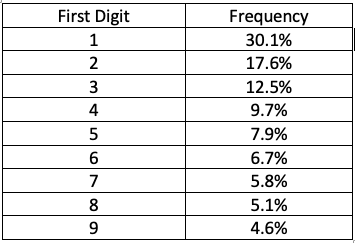
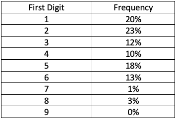
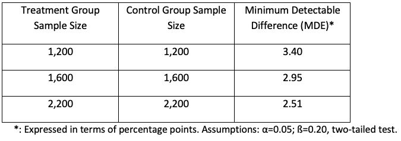

```{css, echo=FALSE}
.answer-box {
  background-color: LemonChiffon;
}
```

```{r setup, include=FALSE}
knitr::opts_chunk$set(echo = TRUE)
knitr::opts_chunk$set(options(width = 60))
knitr::opts_chunk$set(class.output = "bg-warning")

packages <- c('haven','dplyr', 'ggplot2', 'reshape2', 'tidyverse', 'pracma',
              'lubridate', 'scales', 'ggthemes', 'gt')  
to_install <- packages[!(packages %in% installed.packages()[,"Package"])]
if(length(to_install)>0) install.packages(to_install, 
                                          repos='http://cran.us.r-project.org')
lapply(packages, require, character.only=TRUE)


```

\definecolor{shadecolor}{RGB}{255, 252, 204}

# INSTRUCTIONS

To successfully complete this problem set, please follow
these steps:

1.  **Download this RMarkdown document file into your
    computer.**

2.  **Insert all your answers into this document.** Guidance
    [**here**](https://www.rstudio.com/blog/exploring-rstudio-visual-markdown-editor/)
    on how to insert objects such as handwritten work or
    screenshot images in your answers.

3.  **SAVE your work frequently**.

4.  To make things easier to visualize in RStudio, you can
    set the view mode as "Visual" instead of as "Source" in
    the top left of your screen (just below the Save
    button).

5.  Once your document is complete, please save it as a PDF
    by clicking the **KNIT** button.

6.  Please submit an electronic copy of the PDF (and any
    separate requested files) to the Canvas course page.

    6.a) If you want to check a PDF version of this problem
    set before starting to work on it, you can always knit
    it. In fact, you can knit the document at any point.

    6.b) If you cannot Knit and it's time to submit the
    problem set, submit the RMarkdown file and make an
    appointment with a member of the teaching team

7.  Remember to consult the R resources from math camp,
    particularly the HKS R cheat sheet (available
    [**here**](bit.ly/HKS-R), which contains many of the
    commands needed to answer the questions in this problem
    set.

# IDENTIFICATION

1.  Your information

```{text}
Last Name: Chaturvedi                        
First Name: Shreya
```

2.  Group Members (please list below the classmates you
    worked with on this problem set):

```{text}
Group members: Manisha Jha, Alice Zhang, Angela Perez (Q1 Review)
```

3.  Compliance with Harvard Kennedy School Academic Code: Do
    you certify that my work in this problem set complies
    with the Harvard Kennedy School Academic Code[^1] (mark
    with an X below)?

[^1]: We abide by the Harvard Kennedy School Academic code
    (available here) for all aspects of the course. In terms
    of problem sets, unless explicitly written otherwise,
    the norms are the following: You are free (and
    encouraged) to discuss problem sets with your
    classmates. However, you must hand in your own unique
    written work and code in all cases. Any copy/paste of
    another's work is plagiarism. In other words, you can
    work with your classmate(s), sitting side-by-side and
    going through the problem set question-by-question, but
    you must each type your own answers and your own code.
    For more details, please see syllabus.

```{text}
                             [ X ] YES                [   ] NO
```

\newpage

# QUESTION 0 - RECORDING TIME

In an effort to understand better and more accurately the
length of time that it takes you to complete problem sets, I
would like to ask you to please fill in the form linked at
the end of this problem set as accurately as possible. **As
you go through this problem set, please keep track of the
time you spend on each question and then record your time
(in minutes).**

# QUESTION 1 -- BENFORD'S LAW

We studied the case of the 2009 Iranian elections in class.
We discussed that the observed distribution of last digit
deviated from what we would have expected if no fraud had
occurred. An important lesson from class is that to properly
detect fraud statistically, we could not rely on testing
only whether the proportion of vote counts that ended in the
digit "7" was different than 10% because this would
constitute cherry-picking. Instead, we needed to conduct a
test that would allow us to test whether the entire
distribution of last digits followed the discrete uniform
distribution (e.g. whether all the proportions were
statistically undistinguishable from 10%). The test we used
was a chi-square test. This problem set question revolves
around another application of the chi-square test.

Numerical data is often used to test for fraud in accounting
data. In particular, people often use "Benford's Law," which
states that naturally occurring data tends to have the
following distribution of [**first**]{.underline} digits.

{width="30%"}

One case in which people applied this rule was in King's
County, NY. The District Attorney's office investigated
potential fraud in tax filings among businesses and found
the following pattern of first digits in 100 income numbers
on various tax returns:

{width="30%"}

We want to determine whether or not these returns are likely
to be fraudulent by testing whether the distribution of
first digits in the 100 tax returns follows Benford's law.
You can use a **Chi-square test** to do this.

1.  As you can see from the tables above, the distribution
    of first digits we observed (second table) is different
    than the distribution of first digits implied by
    Benford's law. Explain why this fact is not enough as
    evidence of fraud, i.e. why do you need to conduct a
    hypothesis test in the first place? Do so in one short
    paragraph, free of technical jargon.

------------------------------------------------------------

::: answer-box
**Answer:**

*Please insert your answer here.*

While the observed distribution of first digits does not
exactly match what we would expect from Benford's law, we
cannot directly claim this to be an evidence of fraud. This
is because it is extremely rare to observe this distribution
exactly in real life. We are more likely to see some pattern
that is broadly similar to the expected one, with some room
for variation due to just random chance. Also, since we are
only looking at 100 tax returns, only a handful of digits
being different due to chance will result in a frequency
that could be 5-7% higher or lower than observed.
:::

------------------------------------------------------------

2.  Ask someone (a classmate, for example) to give you
    feedback on the paragraph above. Ask him/her "if you
    were a policymaker who is intelligent and well not
    versed in statistics, would you understand the
    paragraph? How can I improve it?" Summarize his/her
    feedback in 2-3 sentences and then write a revised
    paragraph below.

------------------------------------------------------------

::: answer-box
**Answer: Feedback by Angela Perez**

Glows:

-   There is no technical language, so it is fairly easy for
    someone who is not well versed in statistics to
    understand your message

-   It's a succinct explanation, and a very clear
    interpretation of why we would never expect to see the
    exact same distribution as Benford's Law

Grows

-   The last sentence does not seem to be adding much more
    valuable information vs. the explanation that has
    already been provided about random fluctuations

-   There is no mention to hypothesis testing, which would
    help the audience understand how we actually determine
    whether or not this is due to random chance, or
    something else explains the difference
:::

::: answer-box
**Answer:**

*Please write your revised paragraph here.*

::: answer-box
While the observed distribution of first digits does not
exactly match what we would expect from Benford's law, we
cannot directly claim this to be an evidence of fraud. This
is because it is extremely rare to observe this distribution
exactly in real life. We are more likely to see some pattern
that is broadly similar to the expected one, with some room
for variation due to just random chance. We need a
hypothesis test to know the probability of this distribution
occuring by chance vs fraud. If the odds of this
distribution by chance is really low, we can consider fraud
as a possibility.
:::
:::

------------------------------------------------------------

3.  Suppose the p-value of this chi-square test was
    0.000053. Interpret the p-value of your test above in
    words and explain what implications it has for your
    assessment of whether fraud occurred in this particular
    context.

------------------------------------------------------------

::: answer-box
**Answer:**

*Please insert your answer here.*

If the p value is 0.000053, this means that the odds of this
event happening by chance is 0.0053% (EXTREMELY UNLIKELY).
As mentioned above, this would be a strong indicator of some
kind of fraud.
:::

------------------------------------------------------------

4.  Conduct the chi-square test using R. Report the p-value
    below[^2].

[^2]: The default for the chisq.test command is to set the
    null hypothesis to be a distribution with equal
    probabilities (e.g. 10% for the Iranian Elections
    example). A custom specification for the null hypothesis
    can be defined with the p argument.

------------------------------------------------------------

```{r echo=T, message=FALSE, warning=FALSE}
# Enter only code here. 
observed<- c(20, 23, 12, 10, 18, 13, 1, 3, 0)
expected<- c(0.301, 0.176, 0.125, 0.097, 0.079, 0.067, 0.058, 0.051, 0.046)
chisq.test(observed,p = expected)

```

::: answer-box
**Answer:**

*Please insert your answer here.*

p value = 0.000053
:::

------------------------------------------------------------

5.  [**Optional**]{.underline}: Conduct the chi-square test
    using Excel. Report the p-value. Is your answer the same
    you got when you used R? If so, write the word
    "[**Magic**]{.underline}" in the box below.

------------------------------------------------------------

::: answer-box
**Answer:**

*Please insert your answer here.*
:::

------------------------------------------------------------

NOTE: Please remember to **record the time** it took you to
complete this question.

\newpage

# QUESTION 2 -- ASSESSING STATISTICAL POWER IN SCHOOLING INTERVENTION

The table below shows minimum detectable effects for a
program aimed at increasing school attendance.

{width="50%"}

Suppose you were willing to decrease the desired statistical
power ($1-\beta$) from 80% to 70%. Keeping everything else
(including $\alpha$ and sample size) constant, what would
happen to the MDEs reported in the table?

A.  [ ] They would increase
B.  [ ] They would stay the same
C.  [x] They would decrease
D.  [ ] Not enough information
E.  [ ] I don't know

------------------------------------------------------------

::: answer-box
**Answer:**

*Select one of the alternatives above (by clicking in the
selected option) and justify your answer here.*

If we decrease power from 80% to 70%, we are essentially
lowering the probability of detecting an effect when there
is one from 80/100 times to 70/100 times. As a result, we
have a lower level of minimum effect we need to detect to
declare impact. This is also evident from the formula in the
handout.
:::

------------------------------------------------------------

NOTE: Please remember to **record the time** it took you to
complete this question.

\newpage

# QUESTION 3 -- PRACTICE EXAM

You will find past midterm exams (with and without
solutions) for 2018, 2019 and 2021[^3], practice problems,
and suggested answers to the quizzes at the end of the
online modules in the following link:

[^3]: The 2020 midterm was done remotely and was different
    from the typical midterm.

<https://www.dropbox.com/sh/e9s1q894pj6k6wc/AACF4AwwjyJyZEABs7SUv64Ga?dl=0>

Note that his link is also posted on the course website
(schedule on the home page; "**Material to prepare for
midterm exam**" link in the row corresponding to the
midterm).

The goal of this question is to help you prepare for the
midterm exam and reflect on what adjustments, if any, are
needed in your preparation.

1.  **You will be allowed to use two double-sided cheat
    sheets during the exam**. Prepare your draft
    double-sided cheat sheets that have all the formulas and
    things you would like to have with you during the exam.
2.  Take the midterm from 2019 in exam-like conditions,
    i.e., sit down and do the exam in **80 minutes** with
    the cheat sheet and a calculator.
3.  Once you are done taking the exam, compare your answers
    to the suggested solutions.
4.  What lessons did you learn from (3)? [1 short paragraph]

------------------------------------------------------------

::: answer-box
**Answer:**

*Please insert your answer here.*

Learnings: \
1. One sided vs two sided tests (I know we always use two
sided tests but I was not 100% sure of why) - I realised
that this was still not clear to me at the time of writing
the test

2.  Interpreting regression tables more intuitively

3.  Not from the midterm but this problem set: I struggled a
    bit with the power and MDE question
:::

------------------------------------------------------------

5.  Given (4), describe briefly your plans for studying for
    the exam. [1 short paragraph]

------------------------------------------------------------

::: answer-box
**Answer:**

*Please insert your answer here.*

Given these learnings, I think I need to prioritize
evaluation testing and power calculations for the test. I am
fairly comfortable with probabilty and decision trees and
will go over relatively more briefly.
:::

------------------------------------------------------------

[**WHAT TO SUBMIT**]{.underline}:

-   Your answers to questions 4 and 5 above.

-   You [**DO NOT**]{.underline} have to submit the exam

NOTE: Please remember to **record the time** it took you to
complete this question.

\newpage

# QUESTION 4 -- R CODE REVIEW

A good way to continue to improve your coding skills is to
actively review and reflect upon approaches taken by others
to solve the same problem. Please do one of the following:

1.  If you have not already done so, take the time to review
    the suggested code used for the solutions of the
    previous problem sets (posted on Canvas) and compare it
    to your code for that problem

2.  Meet with another student in the course and compare your
    code for a specific R question in one of the earlier
    problem sets that you both found to be challenging

After this review, please briefly describe one new R
approach/lesson you learned and when / how you could use it
in the future.

------------------------------------------------------------

::: answer-box
**Answer:**

*Please insert your answer here.*

I have improved my understanding of ggplot. I usually
struggle with making nice graphs in all the previous problem
sets, such as customizing the colours and layouts. But I
think I understand how my classsmates have been doing it
incrementally (adding one detail, perfecting it, adding the
next detail). I will try this out in the next problem set
questions on graphs.
:::

------------------------------------------------------------

NOTE: Please remember to **record the time** it took you to
complete this question.

\newpage

# [OPTIONAL] QUESTION 5 -- EXPERIENCE IN DATA COLLECTION

Class #11 will be about sampling and survey design. If you
have experience with any of these subjects, please write a
paragraph [here](https://forms.gle/o1PtGYPbTfjb58C67) about
what this experience was about. I would like to incorporate
your experience to the class if possible. Feel free to
include links or attachments (including pictures of data
collection activities you were involved in). If you have no
experience, no need to take any action.

NOTE: Please remember to **record the time** it took you to
complete this question.

\newpage

# TIME USE

Please enter in the form linked below the time you spent on
each question.

This information will only be used for teaching
improvements; **please be candid** and report the time (in
**MINUTES**) spent in each question.

The form is available here:

<https://forms.gle/cQudWbi4QsG23yVt7>

------------------------------------------------------------

::: answer-box
*Please enter "Done" in this field once you have completed
the form.*
:::

------------------------------------------------------------

\newpage

**This is a copy of your code.**

```{r ref.label=knitr::all_labels(), echo=TRUE, eval=FALSE}
```
