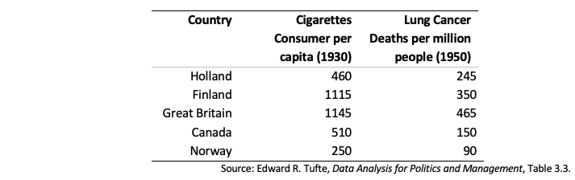

```{css, echo=FALSE}
.answer-box {
  background-color: LemonChiffon;
}
```

```{r setup, include=FALSE}
knitr::opts_chunk$set(echo = TRUE)
knitr::opts_chunk$set(options(width = 60))
knitr::opts_chunk$set(class.output = "bg-warning")

packages <- c('haven','dplyr', 'ggplot2', 'reshape2', 'tidyverse', 'pracma',
              'lubridate', 'scales', 'ggthemes', 'gt','RCT')  
to_install <- packages[!(packages %in% installed.packages()[,"Package"])]
if(length(to_install)>0) install.packages(to_install, 
                                          repos='http://cran.us.r-project.org')
lapply(packages, require, character.only=TRUE)


```

\definecolor{shadecolor}{RGB}{255, 252, 204}

# INSTRUCTIONS

To successfully complete this problem set, please follow
these steps:

1.  **Download this RMarkdown document file into your
    computer.**

2.  **Insert all your answers into this document.** Guidance
    [**here**](https://www.rstudio.com/blog/exploring-rstudio-visual-markdown-editor/)
    on how to insert objects such as handwritten work or
    screenshot images in your answers.

3.  **SAVE your work frequently**.

4.  To make things easier to visualize in RStudio, you can
    set the view mode as "Visual" instead of as "Source" in
    the top left of your screen (just below the Save
    button).

5.  Once your document is complete, please save it as a PDF
    by clicking the **KNIT** button.

6.  Please submit an electronic copy of the PDF (and any
    separate requested files) to the Canvas course page.

    6.a) If you want to check a PDF version of this problem
    set before starting to work on it, you can always knit
    it. In fact, you can knit the document at any point.

    6.b) If you cannot Knit and it's time to submit the
    problem set, submit the RMarkdown file and make an
    appointment with a member of the teaching team

7.  Remember to consult the R resources from math camp,
    particularly the HKS R cheat sheet (available
    [**here**](bit.ly/HKS-R), which contains many of the
    commands needed to answer the questions in this problem
    set.

# IDENTIFICATION

1.  Your information

```{text}
Last Name:     Chaturvedi                        
First Name:   Shreya
```

2.  Group Members (please list below the classmates you
    worked with on this problem set):

```{text}
Group members: 
```

3.  Compliance with Harvard Kennedy School Academic Code: Do
    you certify that my work in this problem set complies
    with the Harvard Kennedy School Academic Code[^1] (mark
    with an X below)?

[^1]: We abide by the Harvard Kennedy School Academic code
    (available here) for all aspects of the course. In terms
    of problem sets, unless explicitly written otherwise,
    the norms are the following: You are free (and
    encouraged) to discuss problem sets with your
    classmates. However, you must hand in your own unique
    written work and code in all cases. Any copy/paste of
    another's work is plagiarism. In other words, you can
    work with your classmate(s), sitting side-by-side and
    going through the problem set question-by-question, but
    you must each type your own answers and your own code.
    For more details, please see syllabus.

```{text}
                             [X] YES                [   ] NO
```

\newpage

# QUESTION 0 - RECORDING TIME

In an effort to understand better and more accurately the
length of time that it takes you to complete problem sets, I
would like to ask you to please fill in the form linked at
the end of this problem set as accurately as possible. **As
you go through this problem set, please keep track of the
time you spend on each question and then record your time
(in minutes).**

# QUESTION 1 -- SMOKING AND CANCER BIVARIATE REGRESSION

The purpose of this exercise is to help you learn the
mechanics of ordinary least squares (OLS) regression and
understand what the different terms in a regression mean.
You will calculate the regression "by hand" using the
formulas developed in class, and then you will use R to
confirm the calculation. This is the only time in the course
you will be asked to calculate the regression coefficients
manually; I think it is important to do it once so you have
a sense of what is really happening.

Few medical professionals doubt that smoking leads to many
health problems, including lung cancer. While it is more
difficult to determine that smoking causes lung cancer than
simply to say that the two are related, in this assignment
you will perform analysis that can begin to document the
relationship between smoking and lung cancer. However, this
is far from a definitive analysis. The sample is very small,
and no effort is made to control for other differences
between the countries in the sample.

The death rate from lung cancer in 1950 and the per capita
cigarette consumption in 1930 are shown below for five
countries. The cancer rates are shown for a later time
period because it presumably takes time for lung cancer to
develop and be diagnosed. Our hypothesis is that the
dependent variable, lung cancer (Y), is a function of the
independent variable, smoking (X).



1.  Using the appropriate formulas (given in the appendix
    below), show how to calculate each of the following.
    Please (1) write the appropriate formula; (2) plug in
    the appropriate values; and (3) show the computed
    answer. You do not need to show the intermediate
    calculations between steps 2 and 3. Note: You may use
    Excel (or R) to do the calculations as long as you do
    [not]{.underline} use the built-in regression functions.

    a.  $\hat{\beta_1}$, the estimated slope coefficient
        from the regression $Y=\beta_0+\beta_1X+u$

    b.  $\hat{\beta_0}$, the estimated intercept coefficient
        from the same regression

    c.  $\hat{Y_i}$, the predicted values for the five
        countries

    d.  $\hat{u_i}$, the OLS residual for each country

    e.  $\sum_i{\hat{u_i}^2}$, the sum of squared residuals

------------------------------------------------------------

::: answer-box
**Answer:**

*Please insert your answer here.*

Done on excel below
:::


------------------------------------------------------------

2.  Interpret $\hat{\beta_0}$ and $\hat{\beta_1}$ in words.
    Be precise and specific.

------------------------------------------------------------

::: answer-box
**Answer:**

$\hat{\beta_0}$: 20.22. This is the baseline rate of lung
cancer deaths we expect with zero cigarette consumption per
capita. That is, if a country does not smoke at all, it will
have 20.22 lung cancer deaths per million people.

$\hat{\beta_1}$: 0.34. This is the average increase in lung
cancer deaths associated with unit increase in cigarette
smoking. That is, for 1 unit increase in cigarette
consumption per capita, our model expects a 0.34 units
increase in lung cancer deaths.
:::

------------------------------------------------------------

3.  Now you will estimate the same regression you ran before
    but this time in R. Familiarize yourself with running
    regressions in R with the following two *screencasts*
    tailored to this course:

Part 1: [Running `lm`](https://vimeo.com/366640411) goes
over the basic syntax of the `lm` functions mentioned in
lecture.

Part 2: [Summarizing output from
`lm`](https://vimeo.com/366640702) shows how to summarize
and extract quantities of interest from a `lm` object.

------------------------------------------------------------

::: answer-box
**Answer:**

*Please enter " Done"* in this field once you have finished
the *screencasts*.

Done
:::

------------------------------------------------------------

4.  Import the data from the table above into R. The data is
    available in the csv file "table_1.csv". Run a linear
    regression of `lcd` on `cigs`. From the summary R
    output, find and label $\hat{\beta_0}$ and
    $\hat{\beta_1}$. These should match the quantities you
    calculated above

------------------------------------------------------------

```{r echo=T, message=FALSE, warning=FALSE}
# Enter only code here. 
input <- read_csv("table_1.csv")
```

```{r, results = "asis"}
# Insert here the code for yout result table.
model <- lm(lcd ~ cigs, input)
summary(model)
```

::: answer-box
**Answer:**

*Please insert your answer here.*

beta_zero = 20.217

beta_one = 0.3445

These are the same values as above.
:::

------------------------------------------------------------

5.  Consider the hypothesis $H_o$: $\beta_1$=0 in the
    context of the above regression. Would you reject the
    null hypothesis at the 5% significance level? Explain

------------------------------------------------------------

```{r echo=T, message=FALSE, warning=FALSE}
# Enter only code here. 

```

::: answer-box
**Answer:**

*Please insert your answer here.*

Since the p value is 0.02 which is smaller than 0.05, we
reject the null hypothesis beta_one = 0.
:::

------------------------------------------------------------

6.  Answer the following questions:
    a.  What is the value of lung cancer deaths (per
        million) for Norway predicted by the OLS regression?
        What is the real value in the data? What term is
        used to denote their difference?

------------------------------------------------------------

```{r echo=T, message=FALSE, warning=FALSE}
# Enter only code here. 

```

::: answer-box
**Answer:**

*Please insert your answer here.*

Value of lung cancer deaths per million for Norway predicted
by OLS model: 106.35

Value of lung cancer deaths per million for Norway in the
actual data: 90

The Residual (or difference): -16.35
:::

------------------------------------------------------------

b.  Suppose one country exhibits 50 more cigarettes consumed
    (per capita, in 1930) than another country. What would
    your OLS regression predict is the difference in their
    lung cancer deaths (per million)?

------------------------------------------------------------

```{r echo=T, message=FALSE, warning=FALSE}
# Enter only code here. 

```

::: answer-box
**Answer:**

*Please insert your answer here.*

Since our model predicts a 0.34 units increase in lung
cancer deaths for every 1 unit increase in cigarette
consumption, the model would predict a 0.34\*50 = 17 units
increase in lung cancer deaths for 50 units increase in
cigarette consumption.
:::

------------------------------------------------------------

c.  What is the predicted difference in lung cancer deaths
    (per million) between Canada and Holland? How does it
    compare to your answer in (b)?

------------------------------------------------------------

```{r echo=T, message=FALSE, warning=FALSE}
# Enter only code here. 

```

::: answer-box
**Answer:**

*Please insert your answer here.*

The predicted difference between Canada (195.9) and Holland
(178.7) is (17.2), or approximately the same.
:::

------------------------------------------------------------

d.  [**OPTIONAL**]{.underline}: Graph the 5 data points and
    the best-fit regression line using ggplot2. Label the
    axes and data points. Create annotations for the
    residuals as well as well as the slope and intercept of
    the regression line.

------------------------------------------------------------

```{r echo=T, message=FALSE, warning=FALSE}
# Enter only code here. 

```

::: answer-box
**Answer:**

*Please insert your answer here.*
:::

------------------------------------------------------------

[**APPENDIX**]{.underline}**: Selected Regression Formulas
(for Bivariate Regression)**

***Slope and intercept coefficients*****:**

$\hat{\beta_1} = \frac{\sum(X_i-\bar{X})\sum(Y_i-\bar{Y})}{\sum(X_i-\bar{X})^2}$

$\hat{\beta_0} = \bar{Y} - \hat{\beta_1}\bar{X}$

***Predicted values*****:**

$\hat{Y_i} = \hat{\beta_0} + \hat{\beta_1}X_i$

***OLS Residual*****:**

$\hat{u_i} = Y_i - \hat{Y_i}$

NOTE: Please remember to **record the time** it took you to
complete this question.

\newpage

# QUESTION 2 -- ESTIMATING IMPACTS OF A FITNESS PROGRAM

You are in charge of evaluating the impact of a fitness
program at your organization aimed at increasing the number
of steps people walk everyday. You have designed and
implemented an RCT, where you track peoples' steps with a
pedometer for 3 initial weeks. After this tracking period,
participants in the study were divided into a treatment and
control group. The treatment group got a push notification
on their phone telling them their average step count over
the initial weeks, while no message was sent to the control
group. You then recorded total steps after 1 additional week
from when this notification was sent out.

1.  Define the average causal effect of the fitness program.
    Using the framework in handout 13, define conceptually
    and mathematically what is the average causal effect of
    the fitness program on the number of steps for the
    people in the treatment group.

a\. Conceptually (in words):

------------------------------------------------------------

::: answer-box
**Answer:**

Please insert your answer here.

The average causal effect of the fitness program is the
average change in the number of steps between people who
received the notifications and people who didn't, with the
assumption that these two groups of people are on average
similar across aspects except receiving the notification.
:::

------------------------------------------------------------

b\. Mathematically (you can either write the formulas using
*LATEX* or upload a picture of your work):

------------------------------------------------------------

::: answer-box
**Answer:**

Please insert your answer here.
:::

{width="468"}

------------------------------------------------------------

2.  Estimate average effect of the fitness program. The data
    set "Steps.csv" contains the data from the study. It
    includes the following variables:

-   `treatment`: a binary indicator of whether a participant
    was in the treatment or control group

-   `BaselineSteps`: the total number of steps recorded
    after the initial 3 weeks

-   `PostSteps`: the total number of steps recorded after 4
    weeks. Note, this value includes the `BaselineSteps`,
    plus the additional steps taken in the final week (after
    treatment was administered)

-   `StepChange`: the change in steps between the
    `PostSteps` and `BaselineSteps` measurements. This is
    equal to the number of new steps taken in the final week
    of the program

Your boss wants to know whether the fitness program had a
positive impact (on average) on the outcome of interest
(`StepChange`). Conduct the statistical analysis that you
think should be done to respond to your boss and in one
paragraph summarize your conclusions. Feel free to add a
table or graph to your paragraph.

------------------------------------------------------------

```{r echo=T, message=FALSE, warning=FALSE}
# Enter only code here. 
steps <- read_csv("Steps.csv")
model <- lm(StepChange ~ treatment, data = steps)
summary(model)


```

```{r, results = "asis"}
# Insert here the code for yout result table.
bt <- balance_table(steps,"treatment")
names(bt) <- c("Variable","Control Group Mean","Treatment Group Mean","P Value")
bt
```

::: answer-box
**Answer:**

Please insert your answer here.

Conclusions:\
1. We see that the average number of steps in the treatment
group is higher by approximately 2800 and this difference is
statistically significant (very very small p value).

2.  However, we also note the caveat that the treatment and
    control groups were not balanced to begin with (p value
    of difference is almost zero too).

Simply put, our treatment of sending a push notification did
improve the number of steps in the treatment group, but the
treatment group was taking many more steps than the control
group to begin with, so we cannot be sure that this is a
result of the push notification.
:::


------------------------------------------------------------

NOTE: Please remember to **record the time** it took you to
complete this question.

\newpage

# QUESTION 3 -- ONLINE MODULE ON MULTIPLE REGRESSION

[**Background**]{.underline}: The goal of this problem set
question is to help you get familiar with **Multiple Linear
Regression**. You will be asked to watch a short module and
answer some questions in a quiz. The quiz results will give
me information about overall performance of the class that I
will use to prepare for class; your individual performance
in the quiz will be registered in the system but will not
count towards your grade in any way.

To get full credit for this question, you need to engage
with the module and complete the quiz. Please make sure you
[**submit**]{.underline} your answers at the end of the
quiz/survey so that they are registered.

The module is available here:

<https://canvas.harvard.edu/courses/109224/modules/227109>

------------------------------------------------------------

::: answer-box
**Answer:**

*Please insert your answer here.*

Done
:::

------------------------------------------------------------

NOTE: Please remember to **record the time** it took you to
complete this question.

\newpage

# TIME USE

Please enter in the form linked below the time you spent on
each question.

This information will only be used for teaching
improvements; **please be candid** and report the time (in
**MINUTES**) spent in each question.

The form is available here:

<https://forms.gle/iJAiJQfgeXajoMgF7>

------------------------------------------------------------

::: answer-box
*Please enter "Done" in this field once you have completed
the form.*

Done
:::

------------------------------------------------------------

\newpage

**This is a copy of your code.**

```{r ref.label=knitr::all_labels(), echo=TRUE, eval=FALSE}
```
