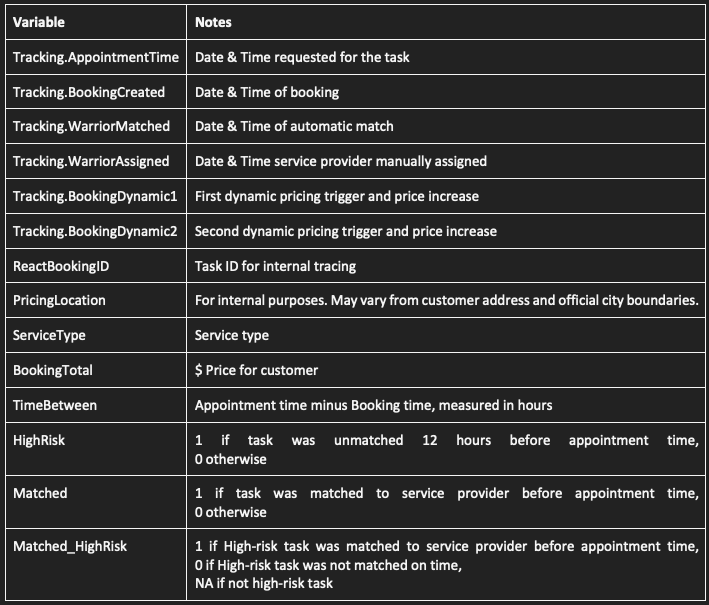
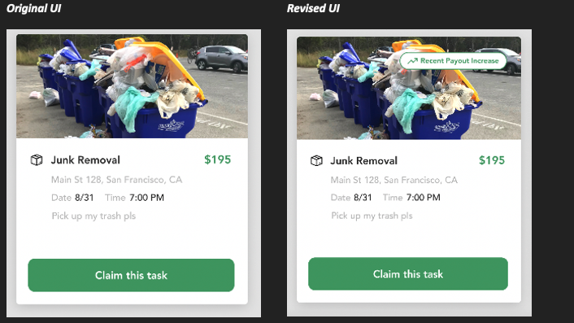
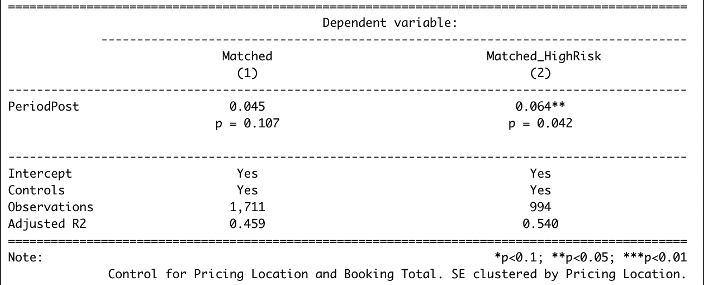

```{css, echo=FALSE}
.answer-box {
  background-color: LemonChiffon;
}
```

```{r setup, include=FALSE}
knitr::opts_chunk$set(echo = TRUE)
knitr::opts_chunk$set(options(width = 60))
knitr::opts_chunk$set(class.output = "bg-warning")

packages <- c('haven','dplyr', 'ggplot2', 'reshape2', 'tidyverse', 'pracma',
              'lubridate', 'scales', 'ggthemes', 'gt','RCT')  
to_install <- packages[!(packages %in% installed.packages()[,"Package"])]
if(length(to_install)>0) install.packages(to_install, 
                                          repos='http://cran.us.r-project.org')
lapply(packages, require, character.only=TRUE)


```

\definecolor{shadecolor}{RGB}{255, 252, 204}

# INSTRUCTIONS

To successfully complete this problem set, please follow
these steps:

1.  **Download this RMarkdown document file into your
    computer.**

2.  **Insert all your answers into this document.** Guidance
    [**here**](https://www.rstudio.com/blog/exploring-rstudio-visual-markdown-editor/)
    on how to insert objects such as handwritten work or
    screenshot images in your answers.

3.  **SAVE your work frequently**.

4.  To make things easier to visualize in RStudio, you can
    set the view mode as "Visual" instead of as "Source" in
    the top left of your screen (just below the Save
    button).

5.  Once your document is complete, please save it as a PDF
    by clicking the **KNIT** button.

6.  Please submit an electronic copy of the PDF (and any
    separate requested files) to the Canvas course page.

    6.a) If you want to check a PDF version of this problem
    set before starting to work on it, you can always knit
    it. In fact, you can knit the document at any point.

    6.b) If you cannot Knit and it's time to submit the
    problem set, submit the RMarkdown file and make an
    appointment with a member of the teaching team

7.  Remember to consult the R resources from math camp,
    particularly the HKS R cheat sheet (available
    [**here**](bit.ly/HKS-R), which contains many of the
    commands needed to answer the questions in this problem
    set.

# IDENTIFICATION

1.  Your information

```{text}
Last Name: Chaturvedi                            
First Name: Shreya
```

2.  Group Members (please list below the classmates you
    worked with on this problem set):

```{text}
Group members: Mayank Sharma, Bharath Ram
```

3.  Compliance with Harvard Kennedy School Academic Code: Do
    you certify that my work in this problem set complies
    with the Harvard Kennedy School Academic Code[^1] (mark
    with an X below)?

[^1]: We abide by the Harvard Kennedy School Academic code
    (available here) for all aspects of the course. In terms
    of problem sets, unless explicitly written otherwise,
    the norms are the following: You are free (and
    encouraged) to discuss problem sets with your
    classmates. However, you must hand in your own unique
    written work and code in all cases. Any copy/paste of
    another's work is plagiarism. In other words, you can
    work with your classmate(s), sitting side-by-side and
    going through the problem set question-by-question, but
    you must each type your own answers and your own code.
    For more details, please see syllabus.

```{text}
                             [X] YES                [   ] NO
```

\newpage

# QUESTION 0 - RECORDING TIME

In an effort to understand better and more accurately the
length of time that it takes you to complete problem sets, I
would like to ask you to please fill in the form linked at
the end of this problem set as accurately as possible. **As
you go through this problem set, please keep track of the
time you spend on each question and then record your time
(in minutes).**

# QUESTION 1 -- TRASH WARRIOR

An urgent and unsolved environmental policy challenge is how
to responsibly manage the waste generated in cities around
the world. The World Bank
[estimates](https://datatopics.worldbank.org/what-a-waste/)
that global waste generation will rise to 3.4 billion tonnes
by 2050 and governments vary widely in their attitudes,
strategies and priorities towards this issue. Further, there
is no consensus [even in the world's richest
cities](https://www.nytimes.com/2022/10/07/nyregion/new-york-city-trash-mckinsey.html)
on which public or private solutions work, and whether they
can be successfully scaled.

MPA/ID graduate Lily Shen was inspired to tackle the
overwhelming problem of open trash dumping in American
cities by addressing some of the market failures that
prevent small businesses in the Waste Management and
Recycling industry from receiving more orders and achieving
their full potential. In addition to her rigorous academic
training, Ms. Shen is also an experienced Silicon Valley
data scientist so it comes as no surprise that the company
she founded embodies both her passion for social impact and
a deep commitment to data-driven design.

Her social enterprise [Trash
Warrior](https://trashwarrior.com/) is an on-demand waste
management and janitorial service platform operating across
3000+ major cities in the United States. She describes their
range of services simply as "*Uber for trash*" i.e.,
connecting waste management and recycling service providers
with paying customers, and deploying digital solutions to
diminish market frictions like search cost, information
asymmetry, price discovery and others. Please watch [this
video from
2020](https://www.youtube.com/watch?v=sxl58xkzF3M) to learn
more about Trash Warrior from Lily herself.

## Problem Statement

In this problem set question you will focus on one aspect of
Trash Warrior's business: **dynamic pricing**. Dynamic
pricing is a market-clearing mechanism that many aggregators
or platforms use. Trash Warrior uses dynamic pricing
algorithms to attract service providers to unmatched tasks
and to improve the overall match rate organically. If tasks
are not organically matched, Trash Warrior must incur
additional costs to manually tele-call service providers to
encourage or 'assign' matches.

Using methods from API-209 you will analyze the results of a
pilot test conducted in July-August 2022 and advise Trash
Warrior on whether the new Dynamic Pricing Algorithm should
be continued. The steps are explained sequentially below.
This analysis presents both the benefits and challenges of a
data-driven decision process, especially when the
opportunity cost of waiting time is high. We hope you enjoy
practicing statistical concepts from the course as well as
your technical communication skills to advise Trash Warrior.

## Data Preparation

Load the data set `tw.RData` using the `load()` command, and
spend a few minutes understanding the variables and
exploring the data set as you have practiced in previous
problem sets.



Confirm that your data set has 2228 rows.

------------------------------------------------------------

```{r}
load("/Users/shreyachaturvedi/Downloads/API209/PS8/tw.RData")
```

::: answer-box
**Answer:**

*Please enter " Done"* in this field once you have confirmed
it.

Done
:::

------------------------------------------------------------

## The Business Problem

Create a new data set for baseline exploratory analysis.
From the original data set filter only those tasks that were
booked between Apr-June 2022 in pricing location Houston.

Suggested R code to filter dates:
`filter(between(lubridate::date(Tracking.BookingCreated), as.Date("01-04-2022", "%d-%m-%Y"), as.Date("30-06-2022", "%d-%m-%Y")))`

Confirm that this new data set has **374** rows.

------------------------------------------------------------

```{r echo=T, message=FALSE, warning=FALSE}
# Enter only code here. 
baselinedata <- tw %>%
  filter(between(lubridate::date(Tracking.BookingCreated), as.Date("01-04-2022", "%d-%m-%Y"), as.Date("30-06-2022", "%d-%m-%Y"))) %>%
  filter(PricingLocation == "Houston")
```

::: answer-box
**Answer:**

*Please enter " Done"* in this field once you have confirmed
it.

Done
:::

------------------------------------------------------------

1.  Start by understanding the distribution of the time
    between when the booking is made and when the task is
    scheduled. This is an important constraint for Trash
    Warrior because a service provider must be matched to a
    customer's task within this time. If most tasks tend to
    be booked at short notice it could be difficult for the
    market to 'clear'. Make a presentation-ready histogram
    of the variable `TimeBetween`. Display your key takeaway
    in the graph's subtitle and add any other visual
    elements that would help the reader.

------------------------------------------------------------

```{r echo=T, message=FALSE, warning=FALSE}
# Enter only code here. 
baselinedata %>%
ggplot(aes(x = TimeBetween, alpha = 0.9)) +
geom_histogram() +
labs(x="Time Between",
y = "Count",
title="Histogram for time taken between creation and scheduling",
subtitle="n = 374, Median Booking Time of 20.16 Minutes, 94% of All Bookings Handled in <100 Minutes") +
theme(plot.title=element_text(size=12, hjust=0),
plot.subtitle=element_text(size=8,hjust=0),
plot.caption= element_text(size=7),
axis.title.x=element_text(size=12,hjust=0.5),
axis.title.y=element_text(size=12,hjust=0.5)) +
theme(legend.position = "none",legend.title = element_blank())
```

------------------------------------------------------------

2.  Now calculate and report the monthly match rate for the
    following in a single table:

-   \% of all tasks matched, reported separately by the
    month of booking
-   \% of high-risk tasks matched, reported separately by
    the month of booking

------------------------------------------------------------

```{r echo=T, message=FALSE, warning=FALSE}
# Enter only code here. 
test <- baselinedata %>%
  mutate(month = format(Tracking.BookingCreated, "%m"), year = format(Tracking.BookingCreated, "%Y")) %>%
  mutate(Matched01 = ifelse(Matched,1,0)) %>%
  mutate(HRMatched01 = ifelse(Matched_HighRisk,1,0)) %>%
  group_by(month) %>%
  mutate(matched = mean(Matched01)) %>%
  mutate(hrmatched = mean(HRMatched01, na.rm = TRUE)) %>%
  select(month, hrmatched, matched) %>%
  ungroup() %>%
  unique() %>%
   gt() %>%
  tab_header(
    title = "Month-Wise Trends",
  ) %>%
  cols_label(
    matched = "Matched",
    hrmatched = "High Risk Matched",
    month = "Month"
  )

  test
```

```{r, results = "asis"}
# Insert here the code for your results table.

```

------------------------------------------------------------

3.  What is the trend over time in both metrics you reported
    in the previous question? Briefly explain the
    consequences in 1-2 sentences each for:

-   Trash Warrior's business costs
-   **[Optional]** For other stakeholders such customers and
    service providers who use the platform and city
    residents in general

------------------------------------------------------------

::: answer-box
**Answer:**

Please insert your answer here.

As we can see in the table above, the trend in both matched
and high risk matched metrics is downward. That is, both
metrics are consistently dropping over time. As a
consequence, fewer requests are matched with service
providers.
:::

------------------------------------------------------------

## Houston Pilot

Trash Warrior has a Dynamic Pricing Algorithm as well as
several UI/UX design features that facilitate
market-clearing. In July 2022 they proposed a few changes to
both. [The algorithm was edited]{.underline} such that the
first dynamic pricing trigger would be issued 12 hours
before the Appointment Time (earlier it was not triggered
until T-5 hours) and the subsequent triggers were adjusted
accordingly. [The interface was also
re-designed]{.underline} to make these tasks more visible
and attractive to service providers.



These changes were gradually rolled out in different
locations for pilot-testing and we will **use data from
before and after the roll-out to assess effectiveness.**

The changes were first rolled out in Houston on July 21,
2022. Prepare a data set to analyze the results of the
Houston pilot by following these instructions.

-   From the original data set you imported, filter to keep
    only tasks booked in Pricing Location Houston between 01
    July 2022-10 August 2022

-   Create a new factor variable to label tasks booked
    between 01 July - 20 July as "Pre" and those between 21
    July - 10 August as "Post". Set "Pre" as the first
    factor level to make subsequent data analysis easier.

-   Assume that a Balance Test performed on the
    characteristics of tasks available in this data set
    shows that Pre & Post groups are comparable i.e. the
    means are not statistically different.

Confirm that there are 65 observations in Pre and 63
observations in the Post group.

------------------------------------------------------------

```{r echo=T, message=FALSE, warning=FALSE}
# Enter only code here. 
pilotdata <- tw %>%
  filter(between(lubridate::date(Tracking.BookingCreated), as.Date("01-07-2022", "%d-%m-%Y"), as.Date("10-08-2022", "%d-%m-%Y"))) %>%
  filter(PricingLocation == "Houston") %>%
  mutate(Pre = ifelse(between(lubridate::date(Tracking.BookingCreated), as.Date("01-07-2022", "%d-%m-%Y"), as.Date("20-07-2022", "%d-%m-%Y")),1,0))
```

::: answer-box
**Answer:**

*Please enter " Done"* in this field once you have confirmed
it.

Done
:::

------------------------------------------------------------

4.  Perform a t-test for the difference in match rate for
    all tasks between the two groups. Interpret the results.

------------------------------------------------------------

```{r echo=T, message=FALSE, warning=FALSE}
# Enter only code here. 
ttest <- pilotdata %>%
  mutate(Matched01 = ifelse(Matched,1,0)) %>%
  mutate(PreMatched = ifelse(Pre == 1, Matched01, NA)) %>%
  mutate(PostMatched = ifelse(Pre == 0, Matched01, NA)) %>%
  select(PreMatched, PostMatched)

t.test(ttest$PreMatched,ttest$PostMatched, var.equal = FALSE)

```

::: answer-box
**Answer:**

Please insert your answer here.

We fail to reject that there is any difference between the
pre and post treatment groups.
:::

------------------------------------------------------------

5.  Write a regression equation in the form of a Population
    Regression Function (PRF) to estimate the same result
    and circle/highlight/indicate the terms or parameters
    you would use to estimate the effect of the ruleset
    change.

------------------------------------------------------------

::: answer-box
**Answer:**

Please insert your answer here.
:::


------------------------------------------------------------

6.  Run this regression. Is the coefficient of interest
    equal to the difference between group means reported in
    the t-test? Interpret the result, p-value and
    statistical significance.

------------------------------------------------------------

```{r echo=T, message=FALSE, warning=FALSE}
# Enter only code here. 
pilotdata <- pilotdata %>%
  mutate(Matched01 = ifelse(Matched,1,0))

model <- lm(Matched01 ~ Pre, pilotdata)
summary(model)

```

```{r, results = "asis"}
# Insert here the code for your results table.

```

::: answer-box
**Answer:**

Please insert your answer here.

We get the same result as we do in the ttest, with the pre
matching rate being 0.68 and post matching rate neing 0.70.
The p values in both cases is 0.795, which means that we
fail to reject the null hypothesis.
:::

------------------------------------------------------------

7.  Can Trash Warrior rely on this regression result to
    decide whether the new Dynamic Pricing Algorithm works?
    Explain why/why not.

------------------------------------------------------------

::: answer-box
**Answer:**

Please insert your answer here.

I don't think that trash warriors can rely on this
regression to decide whether the pricing works as a simple
pre post analysis doesnt give us a counterfactual - What if
across the board some external factors caused the rate to
drop to 0.5, but because of this algorithm it remained at
0.7 in Houston? In this case the impact of the algorithm
would definitely not be zero.
:::

------------------------------------------------------------

## All Cities Pilot

On 4th August 2022 the pilot was extended to all of Trash
Warrior's locations in the United States, so you decide to
take advantage of the larger sample. From the original data
set you imported, you have filtered to keep only tasks
booked between 21 July - 31 August in all Pricing Locations
that are not Houston. Your data set in this case has 1254
and 472 observations in Pre and Post groups respectively.

8.  A larger sample is generally better, but you remember
    from API-209 that statistical power also depends on
    $\alpha$, $\beta$ and MDE. Just thinking about that
    confusing topic gives you a headache, so you decide to
    pause and think about practical significance instead.
    Write a short Slack message to David Chang (Trash
    Warrior's Product Manager in-charge of the pricing
    algorithms) asking about the threshold for practical
    significance. Avoid statistical jargon if possible.

------------------------------------------------------------

```{r}
allcitiespilot <- tw %>%
  filter(between(lubridate::date(Tracking.BookingCreated), as.Date("21-07-2022", "%d-%m-%Y"), as.Date("31-08-2022", "%d-%m-%Y"))) %>%
  filter(PricingLocation != "Houston") %>%
  mutate(Post = ifelse(between(lubridate::date(Tracking.BookingCreated), as.Date("21-07-2022", "%d-%m-%Y"), as.Date("03-08-2022", "%d-%m-%Y")),1,0))
```

::: answer-box
**Answer:**

Please insert your answer here.

Hi David,\
\
Hope everything is going great! I was just going over some
of the data for our all cities pilot and had a quick
question for you: At approximately how much change (with
respect to the base value) of matching rate would you
consider the algorithm to be a success?\
\
Shreya
:::

------------------------------------------------------------

9.  David replies "Honestly, this intervention is so cheap
    that I'd be ok with a small effect like we saw in
    Houston. Even a small but real improvement is a win for
    users. Also, we're constantly innovating and
    experimenting with product features, so the investors
    and industry as a whole have a higher tolerance for
    false positives/false negatives on statistical
    tests...maybe you want to keep that in mind?" Does David
    care about statistical significance? Does David care
    about practical significance? Use phrases from his
    message to support your answer.

------------------------------------------------------------

::: answer-box
**Answer:**

Please insert your answer here.

This basically means that David is not as concerned with
statistical significance ("higher tolerance for false
positives/false negatives on statistical tests"). Since the
cost of the intervention is low, even a small magnitude of
change is practically significant - David's main concern.
:::

------------------------------------------------------------

10. While you were chatting with David, your Enthusiastic
    Friend went ahead and ran the regressions on the new
    data set you have created above. Assuming that you can
    trust their work, interpret the main results from their
    table below. Remember to look at the dependent and
    independent variables, sample size, coefficient size and
    statistical significance.



::: answer-box
**Answer:**

Please insert your answer here.

The treatment has some impact on both matched and high risk
matched rates. In the case of matched, there is
approximately a 5% increase in matched rate as a result of
the algorithm but this is not statistically significant at
95% level. In the case of high risk matched, there is
approximately a 6% increase in matched rate which is
significant at a 5%. Some things to note are:

1.  The sample size for high risk matched is about half of
    the total matched rate, which may have reduced our
    power.
2.  While the effects are of similar magnitude, one is
    statistically significant and one isn't. However, from
    our interaction with David, both would be of interest or
    practical significance since the cost of the
    intervention is pretty low.
:::

11. Lily Shen mentions to you that the Board members are
    concerned about the declining match rate and that she
    wants to update them about the new Dynamic Pricing
    Algorithm. Considering all the pilot tests done,
    additional information received from David Chang, and
    understanding that you need to strike a balance between
    statistical validity and business needs in a fast-paced
    environment, would you advise her to continue with the
    new algorithm or not to? Send your clear recommendation
    and reasoning to the CEO in 1 paragraph. Avoid technical
    jargon since she may forward your email to the Board!

------------------------------------------------------------

::: answer-box
**Answer:**

Please insert your answer here.

Hi Lily,\
I think it would be a good idea to continue testing out the
algorithm for a couple of reasons:

1.  We have seen improvement in the matching rate and high
    risk matching rate in our pilots on a country level.

2.  While the magnitude of the difference is not very large,
    these algorithms are not expensive to implement so it is
    low hanging fruit for us to implement.

3.  As we expand the algorithm use over longer periods of
    time, we will get more data that helps us definitely
    assess the impact on matching rate.

    Please let me know if you'd like to discuss further.

    Best,\
    Shreya
:::

------------------------------------------------------------

NOTE: Please remember to **record the time** it took you to
complete this question.

\newpage

# QUESTION 2 -- ESTIMATING IMPACTS ON STEPS, PART II

In your previous problem set, you were asked to describe
what you would do with a data set to estimate the effects of
a program to increase the number of steps people take a day.
Most answers included a comparison of means between the
treatment and control groups or a bivariate regression, and
concluded that the program had a statistically significant
effect of 2,793 steps. The goal of this problem set question
is to help you see the importance of examining and
visualizing the data [**before**]{.underline} running any
regressions.

1.  If properly conducted, the RCT helps ensure that the
    treatment and control groups are equivalent at baseline.
    Is there evidence in the data that supports this claim?
    To answer this question, compare the average number of
    steps at baseline between treatment and control groups.
    Is the difference between the two groups statistically
    significant? What does this say about the credibility of
    this RCT?

------------------------------------------------------------

```{r echo=T, message=FALSE, warning=FALSE}
# Enter only code here. 
steps <- read_csv("Steps.csv")
bt <- balance_table(steps,"treatment")
names(bt) <- c("Variable","Control Group Mean","Treatment Group Mean","P Value")
bt
```

```{r, results = "asis"}
# Insert here the code for your results table.

```

::: answer-box
**Answer:**

Please insert your answer here.

The difference at baseline in the number of steps between
the treatment and the control groups is large and
statistically significant (extremely small p value). This
indicates to me that the groups are not balanced at the
outset, and raises questions in my mind regarding the
validity of this experiment.
:::

------------------------------------------------------------

2.  Now let's focus on the outcome variable (`StepChange`),
    which measures the number of steps that people took in
    the final week of the program. What would you expect to
    be the distribution of this variable? Create a histogram
    of this variable. Is this what you expected? What does
    this say about the credibility of the outcome variable
    used in this RCT?

------------------------------------------------------------

```{r echo=T, message=FALSE, warning=FALSE}
# Enter only code here. 
stept <- steps %>%
  filter(treatment == 1)
stepc <- steps %>%
  filter(treatment == 0)

plott <- ggplot(stept , aes(x = StepChange)) +
geom_histogram(alpha = 0.2, color ="white",fill ="indianred") +
labs(x="Step Change",
y = "Count",
title="Histogram for step change (Treatment Only)") +
theme(plot.title=element_text(size=12, hjust=0),
plot.subtitle=element_text(size=8,hjust=0),
plot.caption= element_text(size=7),
axis.title.x=element_text(size=12,hjust=0.5),
axis.title.y=element_text(size=12,hjust=0.5)) +
theme(legend.position = "none",legend.title = element_blank())

plotc <- ggplot(stepc , aes(x = StepChange)) +
geom_histogram(alpha = 0.2, color ="white",fill ="indianred") +
labs(x="Step Change",
y = "Count",
title="Histogram for step change (Control Only)") +
theme(plot.title=element_text(size=12, hjust=0),
plot.subtitle=element_text(size=8,hjust=0),
plot.caption= element_text(size=7),
axis.title.x=element_text(size=12,hjust=0.5),
axis.title.y=element_text(size=12,hjust=0.5)) +
theme(legend.position = "none",legend.title = element_blank())

plott
plotc
```

::: answer-box
**Answer:**

Please insert your answer here.

I expect the distribution of outcome variable to be normal
for both treatment and controls, but here the outcome
variables are more uniformly distributed. Further, the
outcome variable is strongly correlated with the baseline
steps - which, as we established, is not balanced between
treatment and control groups. The variable distribution also
skews differently for both treatment and control groups.
This is not ideal in an RCT.
:::

------------------------------------------------------------

3.  What lessons do you draw from this exercise as you think
    about the next time you are about to start running
    regressions on a data set?

------------------------------------------------------------

::: answer-box
**Answer:**

Please insert your answer here.

I think the most important takeaway here is to ensure
balance in the treatment and control variables before
running any regressions. Further, it is important to check
if these variables have any correlation with other variables
in our dataset.
:::

------------------------------------------------------------

4.  [**[Optional]**]{.underline} It turns out the data set
    you analyzed is a masked version of a data set that was
    used to produce a highly influential paper that argued
    that dishonesty can be reduced by asking people to sign
    a statement of honest intent before providing
    information (i.e., at the top of a document) rather than
    after providing information (i.e., at the bottom of a
    document). The paper was based on a field experiment
    conducted by an auto insurance company in the
    southeastern United States. Customers were asked to
    report the current odometer reading of up to four cars
    covered by their policy. They were randomly assigned to
    sign a statement indicating, "*I promise that the
    information I am providing is true*" either at the top
    or bottom of the form. Customers assigned to the
    'sign-at-the-top' condition reported driving 2,400 more
    miles than those assigned to the 'sign-at-the-bottom'
    condition. This was seen as evidence that signing at the
    top could be a cheap and effective way of reducing
    dishonesty. The data set you analyzed last week is the
    one used in this paper except that we referred to the
    outcome as steps taken rather than miles driven, and we
    focused on the odometer reading of the first car only
    (hence the impact you found was slightly different than
    the one reported in the paper). The analysis you
    conduced above plus some additional analyses provided
    compelling evidence that the findings from the paper
    were not real and were partially based on fake data.
    [This posting](http://datacolada.org/98) goes over many
    of the details. The authors of the paper retracted the
    original publication, and several of them issued
    personal replies to the posting. This controversy raised
    some important issues about data analysis,
    reproducibility of research findings, detection of fake
    data, and admission of error. Feel free to comment below
    and/or on our Slack workspace (using the \# problem-sets
    channel) your views about any of these issues.

------------------------------------------------------------

::: answer-box
**Answer:**

Please insert your answer here.
:::

------------------------------------------------------------

NOTE: Please remember to **record the time** it took you to
complete this question.

\newpage

# QUESTION 3 -- ONLINE MODULES

[**Background:**]{.underline} You will be asked to watch two
short modules and answer some questions in a quiz. The quiz
results will give me information about overall performance
of the class that I will use to prepare for class; your
individual performance in the quiz will be registered in the
system but will not count towards your grade in any way.

To get full credit for this question, you need to engage
with the module and complete the quiz. Please make sure you
submit your answers at the end of the quiz/survey so that
they are registered.

The modules is available here:

1.  **Omitted Variable Bias**:
    <https://canvas.harvard.edu/courses/109224/pages/1-omitted-variable-bias?module_item_id=1176571>
2.  **R2 and Standard Errors**:
    <https://canvas.harvard.edu/courses/109224/pages/1-r-squared?module_item_id=1176574>

------------------------------------------------------------

::: answer-box
**Answer:**

*Please enter "Done"* in this field once you have concluded
*BOTH* modules.

Done
:::

------------------------------------------------------------

NOTE: Please remember to **record the time** it took you to
complete this question.

\newpage

# TIME USE

Please enter in the form linked below the time you spent on
each question.

This information will only be used for teaching
improvements; **please be candid** and report the time (in
**MINUTES**) spent in each question.

The form is available here:

<https://forms.gle/n9Z8EYQRw8U4nCaX9>

------------------------------------------------------------

::: answer-box
*Please enter "Done" in this field once you have completed
the form.*
:::

------------------------------------------------------------

\newpage

**This is a copy of your code.**

```{r ref.label=knitr::all_labels(), echo=TRUE, eval=FALSE}
```
