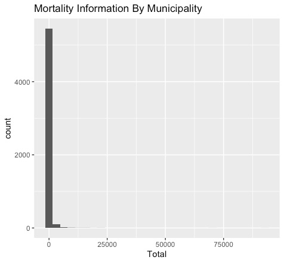
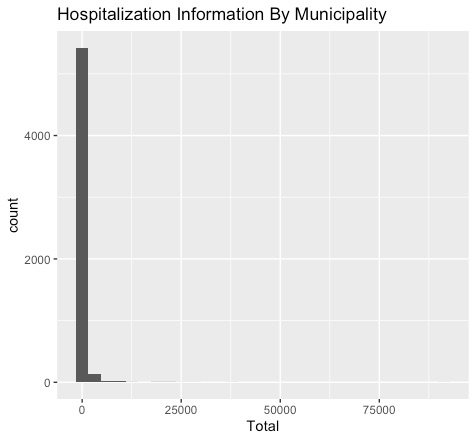

```{css, echo=FALSE}
.answer-box {
  background-color: LemonChiffon;
}
```

```{r setup, include=FALSE}
knitr::opts_chunk$set(echo = TRUE)
knitr::opts_chunk$set(options(width = 60))
knitr::opts_chunk$set(class.output = "bg-warning")

packages <- c('haven','dplyr', 'ggplot2', 'reshape2', 'tidyverse', 'pracma',
              'lubridate', 'scales', 'ggthemes', 'gt', 'tidymodels')  
to_install <- packages[!(packages %in% installed.packages()[,"Package"])]
if(length(to_install)>0) install.packages(to_install, 
                                          repos='http://cran.us.r-project.org')
lapply(packages, require, character.only=TRUE)


```

\definecolor{shadecolor}{RGB}{255, 252, 204}

# GENERAL INSTRUCTIONS

For questions 1-3, the "normal" rules for collaboration in
API-209 problem sets apply, i.e., you are encouraged to work
in a study group, but must write up your own answers. For
question 3 (final exercise), you are asked to work in a
group and everyone in the group should submit the exact same
answers.

# INSTRUCTIONS

To successfully complete this problem set, please follow
these steps:

1.  **Download this RMarkdown document file into your
    computer.**

2.  **Insert all your answers into this document.** Guidance
    [**here**](https://www.rstudio.com/blog/exploring-rstudio-visual-markdown-editor/)
    on how to insert objects such as handwritten work or
    screenshot images in your answers.

3.  **SAVE your work frequently**.

4.  To make things easier to visualize in RStudio, you can
    set the view mode as "Visual" instead of as "Source" in
    the top left of your screen (just below the Save
    button).

5.  Once your document is complete, please save it as a PDF
    by clicking the **KNIT** button.

6.  Please submit an electronic copy of the PDF (and any
    separate requested files) to the Canvas course page.

    6.a) If you want to check a PDF version of this problem
    set before starting to work on it, you can always knit
    it. In fact, you can knit the document at any point.

    6.b) If you cannot Knit and it's time to submit the
    problem set, submit the RMarkdown file and make an
    appointment with a member of the teaching team

7.  Remember to consult the R resources from math camp,
    particularly the HKS R cheat sheet (available
    [**here**](bit.ly/HKS-R), which contains many of the
    commands needed to answer the questions in this problem
    set.

# IDENTIFICATION

1.  Your information

```{text}
Last Name: Chaturvedi                            
First Name: Shreya
```

2.  Group Members (please list below the classmates you
    worked with on this problem set):

```{text}
Group members: Manisha Jha
```

3.  Compliance with Harvard Kennedy School Academic Code: Do
    you certify that my work in this problem set complies
    with the Harvard Kennedy School Academic Code[^1] (mark
    with an X below)?

[^1]: We abide by the Harvard Kennedy School Academic code
    (available here) for all aspects of the course. In terms
    of problem sets, unless explicitly written otherwise,
    the norms are the following: You are free (and
    encouraged) to discuss problem sets with your
    classmates. However, you must hand in your own unique
    written work and code in all cases. Any copy/paste of
    another's work is plagiarism. In other words, you can
    work with your classmate(s), sitting side-by-side and
    going through the problem set question-by-question, but
    you must each type your own answers and your own code.
    For more details, please see syllabus.

```{text}
                             [ X ] YES                [   ] NO
```

\newpage

# QUESTION 1 -- OMMITTED VARIABLE BIAS

As indicated in class, the *sign* of the bias of
$\hat{\beta_1}$ when omitting $X_2$ in the estimation of
$Y=\beta_0 + \beta_1 X_1 + \beta_2 X_2 + u$ can be
summarized in the table below:


Pick [two]{.underline} of the boxes in the table above.
Illustrate ***each*** of these 2 cases with an example.
Assume the regression equation you would like to estimate is
$Y=\beta_0 + \beta_1 X_1 + \beta_2 X_2 + u$, but for some
reason (lack of data or knowledge, for example), you end up
omitting $X_2$ from the regression.

A.  Describe the variables $Y, X_1, X_2$:

------------------------------------------------------------

::: answer-box
**Answer:**

*Please enter your answer here.*

Example 1:

Y = Probability of getting diabetes for an individual

X1 = BMI of individual

X2 = Family History of Diabetes (Number of family members
with diabetes)

Example 2:

Y = Marathon Finishing Time

X1 = Age

X2 = Fitness Level
:::

------------------------------------------------------------

B.  Indicate the sign of the correlation between $X_1$ and
    $X_2$, and explain why you should expect such sign [1-2
    sentences]:

------------------------------------------------------------

::: answer-box
**Answer:**

*Please enter your answer here.*

Example 1: There is a positive correlation between X1 and X2
(people with a family history of diabetes and obesity are
more predisposed to have a higher BMI).

Example 2: There is a negative correlation between X1 and X2
(people who are older tend to have lower fitness levels than
people who are younger).
:::

------------------------------------------------------------

C.  Indicate the sign of $\beta_2$, and explain why you
    would expect such sign [1-2 sentences]:

------------------------------------------------------------

::: answer-box
**Answer:**

*Please enter your answer here.*

Example 1: beta2 is positive - Each additional member who
has diabetes in one's family increases their odds of being
diagnosed with diabetes

Example 2: beta2 is negative - A higher fitness level is
associated with a lower marathon finishing time
:::

------------------------------------------------------------

D.  Indicate the sign of the bias if you were to omit $X_2$
    from the regression, and explain why you would expect
    such sign [1-2 sentences]:

------------------------------------------------------------

::: answer-box
**Answer:**

*Please enter your answer here.*

In both cases, the bias would be positive. Without X2, the
coefficient of X1 is much larger than what it would have
been with X2 for both the examples.
:::

------------------------------------------------------------

E.  Indicate how your estimated $\hat{\beta_1}$ is likely to
    change when omitting $X_2$ from the regression, i.e.,
    will it get larger or smaller relative to when you
    estimate the full regression (with both $X_1$ and $X_2$
    as explanatory variables)? Explain your reasoning both
    in technical terms (using your answers to the previous
    sub questions) and in terms a policymaker can understand
    (i.e., explain whether you will be over or understating
    the importance of $X_1$).

------------------------------------------------------------

::: answer-box
**Answer:**

*Please enter your answer here.*

For both examples, beta1 is likely to get larger as a result
of omitting X2 from the regression. As the bias is positive,
the coefficient is further pushed away from zero (alpha1 is
beta1 + BIAS), hence alpha1\> beta1.

Intuitively, we understand that if we remove X2 from the
regression (possibly because they are not directly
observable in the case of fitness levels or difficult to
obtain data on in the case of family history), we overstate
the importance of X1 on the dependent variable Y.
:::

------------------------------------------------------------

F.  **Training and Wages:** Suppose that wages depend on two
    factors: hours of training (`hourstraining`) and years
    of education (`educ`):

    $wage_i=\beta_0 + \beta_1 hourstraining_i + \beta_2 educ_i + u_i$

    Suppose that in a certain city, a large subsidy was
    offered to workers with low levels of schooling such
    that `hourstraining` and `educ` are negatively
    correlated. Suppose you had data on workers that live in
    the city where the program is operating, and you
    estimate:

    $wage_i=\alpha_0 + \alpha_1 hourstraining_i + v_i$

    Do you think $\hat{\alpha_1}$ is an unbiased estimator
    of the causal effect of hours of training on wages? If
    yes, explain why. If not, explain whether omitting
    `educ` from the regression is likely to lead to over or
    understating the importance of hours of training for
    wages.

------------------------------------------------------------

::: answer-box
**Answer:**

*Please enter your answer here.*

No, I do not think alpha1(hat) is an unbiased estimator of
the causal effect on hours of training on wages. This is
because there is omitted variable bias since hours of
training and education are correlated, AND education is also
a determinant of wages.\
In this case, since beta2(hat) is positive and the
correlation between X1 and X2 is negative, the sign of bias
is negative. In other words, omitting education from the
regression is likely to understate the importance of hours
of training on wages.
:::

------------------------------------------------------------

\newpage

# QUESTION 2 -- CONCEPTUAL QUESTIONS ABOUT REGRESSIONS AND RCTs

1.  For your first example in the previous question, answer
    the following question: As you move from the short
    regression (the one with only one explanatory variable)
    to the long regression (the one with the two explanatory
    variables), what do you think will happen to the
    standard error of $\hat{\beta_1}$?[^2]

[^2]: You may assume homoskedasticity to answer this
    question.

<!-- -->

A.  [x] They would increase
B.  [ ] They would stay the same
C.  [ ] They would decrease
D.  [ ] Not enough information
E.  [ ] I don't know

Select your preferred option above, and write a paragraph
below justifying your choice:

------------------------------------------------------------

::: answer-box
**Answer:**

*Please insert your answer here.*

This is a case of bias-variance trade off. By adding the
explanatory variable to our regression, we are removing the
omitted variable bias. However, since X1 and X2 are related
to each other the regression cannot disentangle the effects
from each other. As a result, the standard error of
beta1(hat) increases.
:::

------------------------------------------------------------

2.  Suppose you had a well-designed and conducted randomized
    trial (RCT) to estimate the effect of an education
    intervention on test scores. You run a regression
    $testscore = \beta_0 + \beta_1 treat + u$, where
    `testscore` represents the test score two years after
    the intervention. Explain what you think will likely
    happen to the following if we ran the same regression as
    before but included test scores at baseline (i.e.,
    before the program took place) as an additional
    explanatory variable:

<!-- -->

a.  magnitude of $\hat{\beta_1}$

b.  standard error of $\hat{\beta_1}$

    Write a paragraph below justifying your choices:

------------------------------------------------------------

::: answer-box
**Answer:**

*Please insert your answer here.*

Since this is a perfectly designed and conducted RCT, we can
assume that there is no correlation between treatment status
(treat) and baseline test scores. This means that there is
no omitted variable bias here. As a result the magnitude of
beta1(hat) will not change by introducing baseline test
scores. Similarly, because baseline test scores and
treatment status are not related, adding the extra
explanatory variable will not change the standard errors of
beta1(hat)
:::

------------------------------------------------------------

\newpage

# QUESTION 3A -- ONLINE MODULE ON DUMMY VARIABLES

[**Background:**]{.underline} The goal of this problem set
question is to help you deepen your understanding of **Dummy
Variables**. You will be asked to watch a short module and
answer some questions in a quiz. The quiz results will give
me information about overall performance of the class that I
will use to prepare for class; your individual performance
in the quiz will be registered in the system but will not
count towards your grade in any way.

To get full credit for this question, you need to engage
with the module and complete the quiz. Please make sure you
submit your answers at the end of the quiz/survey so that
they are registered. The module is available here:

<https://canvas.harvard.edu/courses/109224/modules/227112>

------------------------------------------------------------

::: answer-box
**Answer:**

*Please enter "Done"* in this field once you have completed
the quiz.

Done
:::

------------------------------------------------------------

\newpage

# QUESTION 3B -- ONLINE MODULE ON NON-LINEAR REGRESSIONS

[**Background:**]{.underline} The goal of this problem set
question is to help you deepen your understanding of
**Non-Linear Regressions**. You will be asked to watch a
short module and answer some questions in a quiz. The quiz
results will give me information about overall performance
of the class that I will use to prepare for class; your
individual performance in the quiz will be registered in the
system but will not count towards your grade in any way.

To get full credit for this question, you need to engage
with the module and complete the quiz. Please make sure you
[**submit**]{.underline} your answers at the end of the
quiz/survey so that they are registered.

The module is available here:

<https://canvas.harvard.edu/courses/109224/modules/227113>

------------------------------------------------------------

::: answer-box
**Answer:**

*Please enter "Done"* in this field once you have completed
the quiz.

Done
:::

------------------------------------------------------------

This is the last online module in this course (see full list
below). These modules were meant to help you learn things
before class, so we can use the in-class time more
productively. Please take 3 minutes to complete this [brief
survey](https://forms.gle/iQbydpAXyhHj2xcu5) to give
anonymous feedback and help improve the modules for the
future.

------------------------------------------------------------

::: answer-box
**Answer:**

*Please enter "Done"* in this field once you have completed
the survey

Done
:::

------------------------------------------------------------

\newpage

# QUESTION 4 - FINAL EXERCISE

**This part of the problem set is designed to be completed
with your final exercise team. As opposed to other problem
set questions where you are asked to write your answers in
your own words, all team members can submit identical
answers for this question. But please submit answers
individually (as part of the problem set you submit) this
time to facilitate the grading.**

[**Note:**]{.underline} The goal of this question is to help
you advance in the final exercise, so you increase your
chances of producing a final product you are proud of. Don't
feel too constrained by the specific prompts you see below.
You should try to answer each of the prompts but your team
should decide how much time it is worth to spend at this
time on each of the items below. Ultimate goal is to nudge
you in the direction of making progress.

Link to final exercise is
[here](https://www.dropbox.com/s/w4qmkrc4r2mpzjt/API-209%20Final%20Exercise%20-%202022%20-%20fv.docx?dl=0).

The first task for your group is to decide which of the
final exercise options you will pursue. Please indicate the
members of your team and your final exercise option by
filling in this [**brief
survey**](https://docs.google.com/forms/d/e/1FAIpQLScy326K7pl8V-KizTMsYQ3uYrkIakunCoQ9jk-_W8LBRj0MwA/viewform).

**NOTE: Only one member of the team should fill in the
survey**

------------------------------------------------------------

::: answer-box
*Please enter "Done" in this field once one member of your
team has filled the survey.*

Done
:::

------------------------------------------------------------

\newpage

## OPTION 1 - Mongolia (Macro)

1.  Download the datasets and familiarize yourself with the
    data. Note that some of the data sets are huge, so you
    will need to store them in a computer with enough
    memory. Which topics are well-captured by the surveys?
    Which topics are not? Take note that while the Mongolian
    National Statistics Office provides most of their micro
    datasets in English, the reports may be in Mongolian. Be
    realistic in the language barrier constraints.

2.  Download and read the seminal paper [Growth
    Diagnostics](https://growthlab.cid.harvard.edu/publications/growth-diagnostics-0)
    (Hausmann, Rodrik and Velasco, 2005). Between your full
    set of group members, also read the expanded ["Mindbook"
    of Growth
    Diagnostics](https://growthlab.cid.harvard.edu/publications/doing-growth-diagnostics-practice-mindbook)
    (Hausmann, Klinger and Wagner, 2008) and examples of
    Growth Diagnostics.

3.  Read/skim background documents on Mongolia to
    familiarize yourself with the economic context.

4.  Brainstorm some possible "tests" that you would run on
    each of the branches of the tree to identify a
    constraint. Start to think about which ones will be
    easier to conduct given the data available and which
    ones may prove challenging. If there is confusion over
    the conceptual underpinnings, consult an example growth
    diagnostic or the teaching team.

5.  Decide how you plan to organize the work. Who will do
    what? Establish some deadlines.

------------------------------------------------------------

::: answer-box
*Please enter your answers here*
:::

------------------------------------------------------------

## OPTION 2 - Health in Brazil (Micro)

1.  Download the data sets you will need and make sure they
    contain all the data that you will need for your
    analysis. Familiarize yourself with the data.

2.  Read/skim background documents so that you familiarize
    yourself with the context.

3.  Present summary statistics for the main variables in the
    PNS, SIM, SIH and CNES data sets. Is there a lot of
    variation across municipalities and states? What
    implications does the answer to this question has in
    terms of coming up with an algorithm that could predict
    the number the burden of diseases at the municipality
    level?

4.  Start thinking about what predictors you might want to
    use to predict the burden of diseases in each
    municipality.

5.  Brainstorm some ideas for what hypotheses you might
    explore and how you might use the data to explore these
    hypotheses.

6.  Decide how you plan to organize the work. Who will do
    what? Establish some deadlines.

------------------------------------------------------------

::: answer-box
*Please enter your answers here*

3.  This shows that there is a lot of variation since many
    municipalities are clustered at lower levels of
    hospitalization and mortality, but some municipalities
    (most likely cities or urban areas) have really high
    levels of hospitalization and mortality. \
    We will explore assigning weights by population density
    in our analysis to avoid skewing disproportionately
    towards urban areas. 
4.  To start with, we want to dig into the following
    variables:
    1.  Current hospitalization rate

    2.  Mortality Rates 

    3.  Socio-economic and health variables from PNS

    4.  Population density

    5.  Vaccination Rates

    6.  Assess trends in big cities vs small rural areas.
        Perhaps recommend different strategies for each of
        these

\
5. Brainstorm some ideas for **what hypotheses you might
explore** and how you might use the data to explore these
hypotheses.

a\. Population density is inversely related to disease
burden.

b\. Income level is inversely proportional to disease
burden.

c\. Municipalities with poor sewer system are in desperate
need of better infrastructure.

d\. The numbers in municipalities with high levels of
socio-economic inequality might not be telling the  whole
story.

e\. Make clusters of municipalities

6.  Timelines:

    Launch meeting: Thursday, November 1

    Meet after API-209 classes

    Tentative Roles:

    1.  Luisa: Minister of Health. Expert on Brazil. R &
        Writing the memo

    2.  Shreya: R

    3.  Bharath: Writing the Memo & PPT

    4.  Kwang: Writing the Memo & PPT

    5.  Masato: R

    6.  Carlos: Writing the Memo & PPT

    Task #1 Deadline: Nov 12

    Task #2 Deadline: Nov 15

    Complete Draft for Memo: Nov 22\
:::

{width="222"}

{width="217"}
